# 📘 Function Class — Complete Action Reference (Custom Internal Flow)

**Package:** `com.mahindra.actions`
**Class:** `Function extends ConnectToDataSheet`
**App Version tracked:** `945`
**Author context:** Mahindra Finance – UDAAN SuperApp Automation Framework
**Doc type:** True internal-behavior documentation (not generic template) with Mermaid flow diagrams.

---

## 🧭 How This Class Works (Read First)

Every test step from the data sheet flows into a single entry method:

```text
ActionRDS() → reads Action column → switch(Action.toUpperCase()) → runs matching case
```

**Execution lifecycle of one step:**

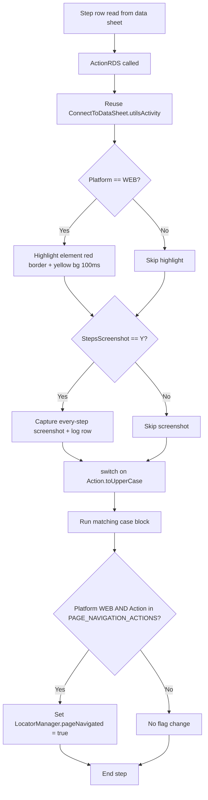

### Glossary (used across all diagrams)
| Term | Meaning |
|------|---------|
| `PropertyValue` | Locator text (usually XPath) coming from the data sheet |
| `PropertyName` | Locator strategy / label for the element |
| `dataSheet2Value` | Test input value for that step |
| `element` / `elements` | Current single/multiple WebElement(s) resolved by `LocatorManager` |
| `getText` | Last stored mobile text value (content-desc/text) |
| `webGetText` | Last stored web text value |
| `applicationID` | Runtime application id under test |
| `contractNumber` | Runtime contract number captured earlier |
| Fallback/Catch | Diagram shows both primary and recovery path for flaky UI |

### Key shared constants
- `PAGE_NAVIGATION_ACTIONS` = `STARTBROWSER, NEWWINDOWBROWSWRTAB, BROWSERURL, NAVIGATEBACK, PAGEREFRESH, CLICK, JAVASCRIPTCLICK, CHECKANDCLICK, WAIT_FOR_NEXTELEMENT`
- `DEFAULT_ACTION_TIMEOUT` = 10s | `SHORT_ACTION_TIMEOUT` = 3s

---

# 📚 Table of Contents (Switch Sequence Order)

1. [Lifecycle & App/Browser Launch](#1-lifecycle--appbrowser-launch)
2. [URL & Page Source](#2-url--page-source)
3. [SendKeys / Text Input Family](#3-sendkeys--text-input-family)
4. [Runtime Data Capture Family](#4-runtime-data-capture-family)
5. [Application ID Store/Update](#5-application-id-storeupdate)
6. [Session Teardown](#6-session-teardown)
7. [Click Family](#7-click-family)
8. [Clear / JS Input Family](#8-clear--js-input-family)
9. [Mobile App Control & Media](#9-mobile-app-control--media)
10. [Random Number & MPIN](#10-random-number--mpin)
11. [Validation Family](#11-validation-family)
12. [Navigation / Keyboard Keys](#12-navigation--keyboard-keys)
13. [Search Application Family](#13-search-application-family)
14. [Popup / Business Flow Family](#14-popup--business-flow-family)
15. [Salesforce (SFDC/CPC) Flows](#15-salesforce-sfdccpc-flows)
16. [Scroll / Swipe Family](#16-scroll--swipe-family)
17. [Persona Handling & Persona Scroll](#17-persona-handling--persona-scroll)
18. [Dropdown / Select Family](#18-dropdown--select-family)
19. [Frame / Window Family](#19-frame--window-family)
20. [Web Scroll Utilities](#20-web-scroll-utilities)
21. [BrowserStack AI](#21-browserstack-ai)
22. [SuperApp Custom Functions](#22-superapp-custom-functions)
23. [Dynamic (default) Actions](#23-dynamic-default-actions)
24. [Helper Methods](#24-helper-methods)

---

# 1) Lifecycle & App/Browser Launch

### `MONITORING_PROPERTIES`
> Marks the start of timing — records `executionStartTime` (nanoTime) and a human-readable timestamp.
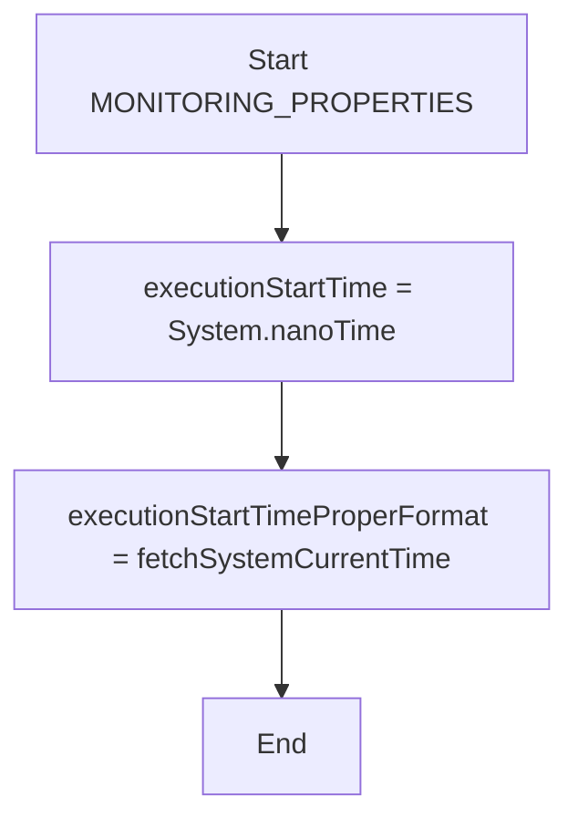

### `START_APPLICATION`
> Loads mobile config, then initializes the driver locally or remotely based on ExecutionType.
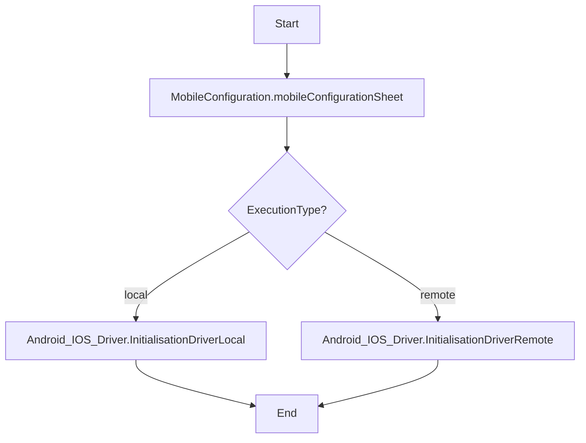

### `INSTALLANDSTARTAPPLICATION`
> Only loads the mobile configuration sheet (driver install/start handled by config).
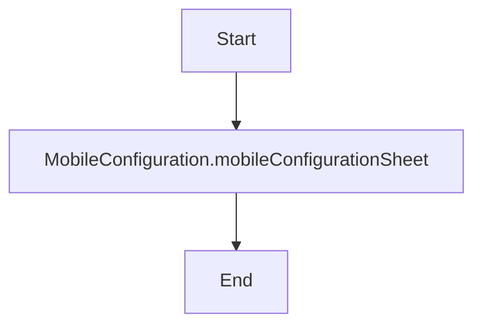

### `STARTBROWSER`
> Initializes the web browser session using the value from the data sheet. (Navigation action)
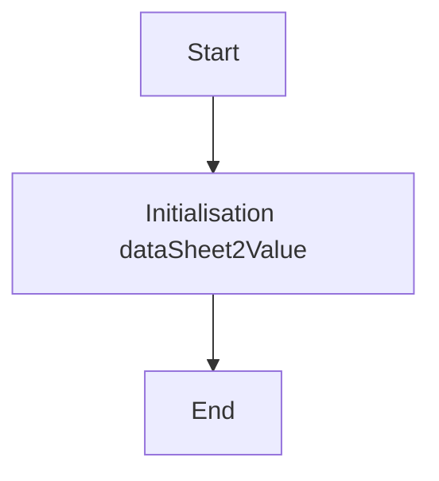

### `NEWWINDOWBROWSWRTAB`
> Opens a brand-new browser tab and switches to it. (Navigation action)
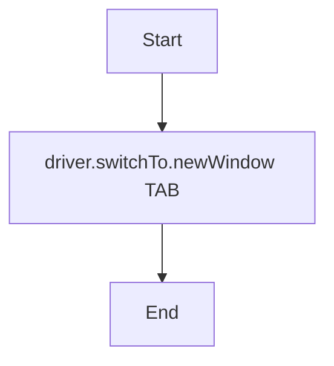

---

# 2) URL & Page Source

### `BROWSERURL`
> Builds a final URL by concatenating parts split on '+'; each part is resolved via ConfigManager, falling back to raw text if not a config key. (Navigation action)
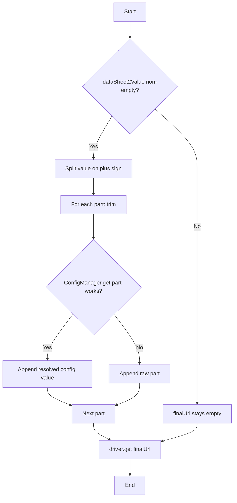

### `GETPAGESOURCE`
> Reads full page source into a local variable (print currently commented out) — used for debugging DOM/state.
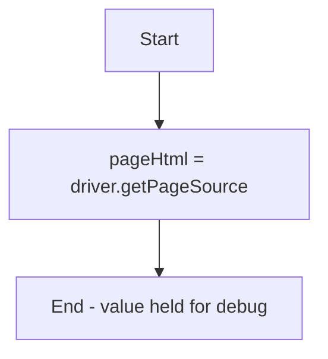

---

# 3) SendKeys / Text Input Family

### `SENDKEYSUSING_CONFIGVALUE`
> Null-checks element, resolves the value from ConfigManager, then types it.
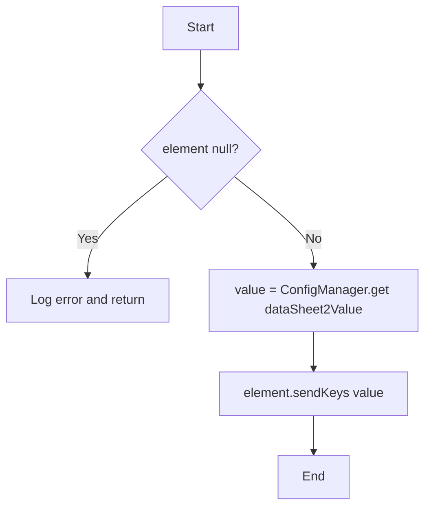

### `SENDKEYSANDENTERKEY`
> Ensures element present, then types the value followed by ENTER key.
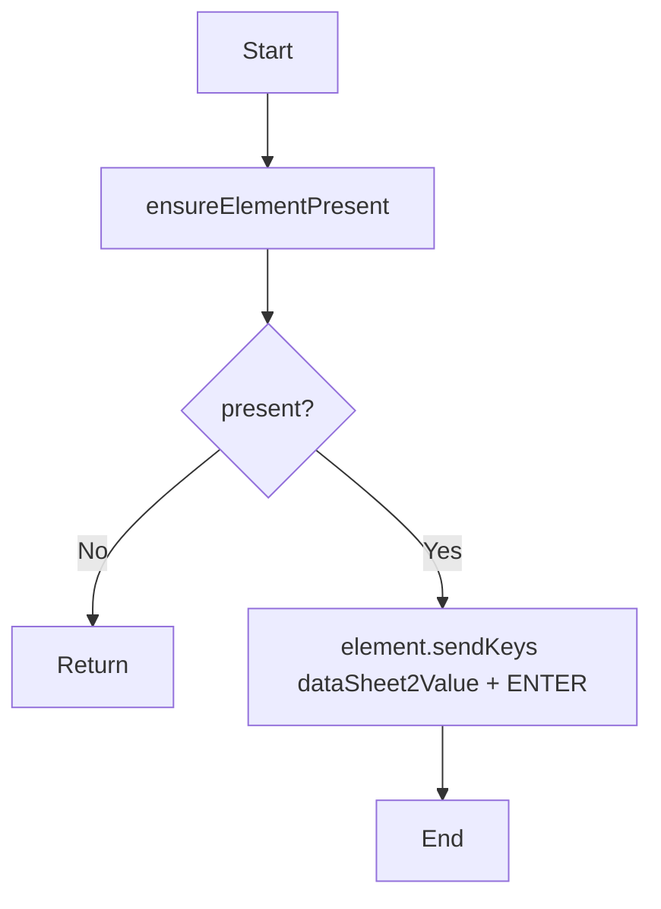

### `ELEMENTWITHENTERKEY`
> Asserts element not null, then presses ENTER on it (no text typed).
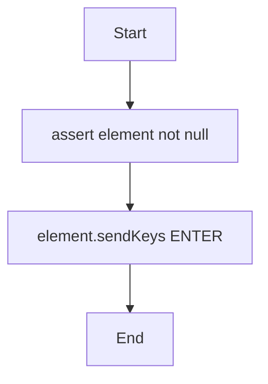

### `APPLICATIONIDSEARCHONSFDC`
> Ensures element present, then types the runtime applicationID + ENTER to search in Salesforce.
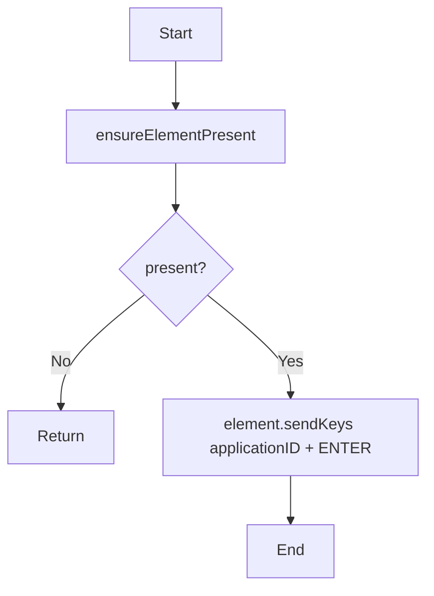

### `KEYBOARDSENDKEYS`
> Tries to resolve value from config; if not a key uses raw value; then uses Actions to type at keyboard level (no specific element focus needed).
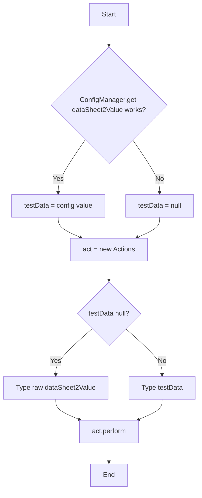

### `SENDKEYS`
> Ensures element present, then types the value only.
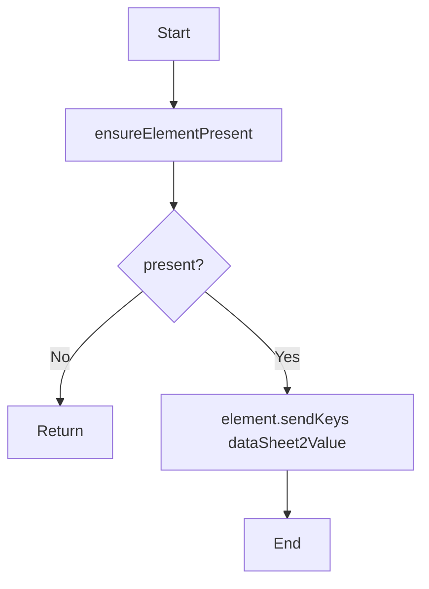

### `SAPCODE_SENDKEYS` / `PASSWORD_SENDKEYS`
> Shared block: null-check element, pick credential key (SAPCODE or PASSWORD), read from System property, fallback to data sheet, type it, log.
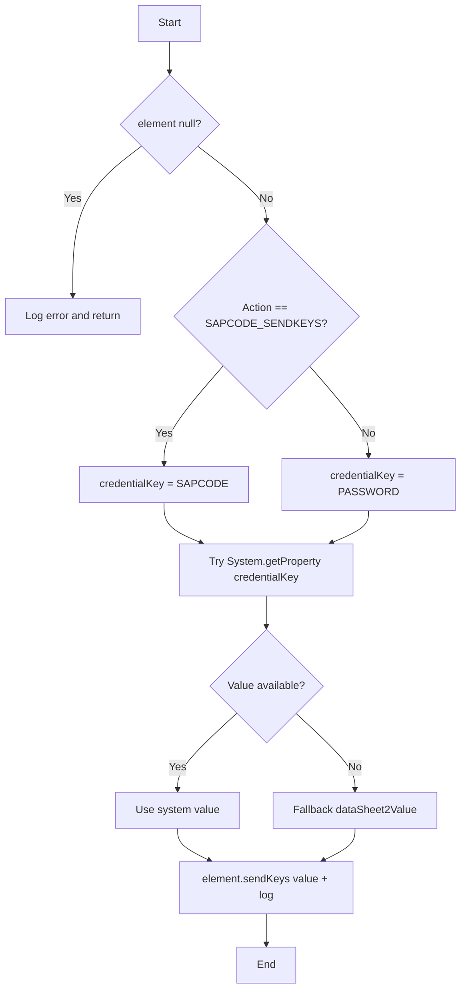

### `CLICKCLEARSENDKEYS`
> Ensures present, waits clickable + click, waits visible, clears, waits clickable, then types new value. Uses SHORT (3s) timeout.
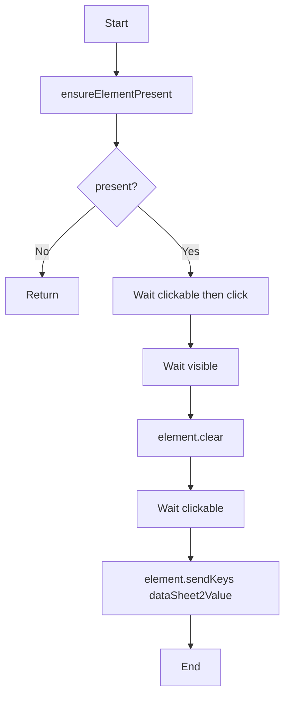

---

# 4) Runtime Data Capture Family

### `APPVERSION`
> Stores the last-read text into the `appVersion` variable.
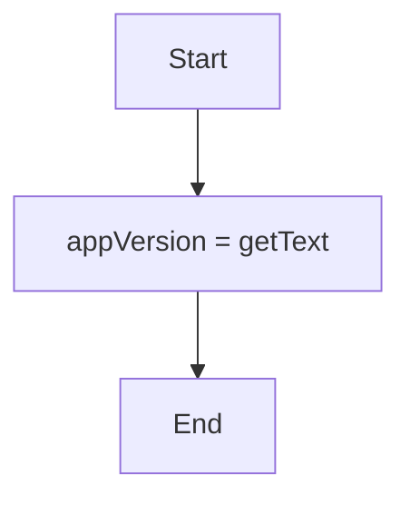

### `MOBILEGETTEXT`
> Reads mobile text: tries `content-desc` first, falls back to `text` attribute; stores in `getText`.
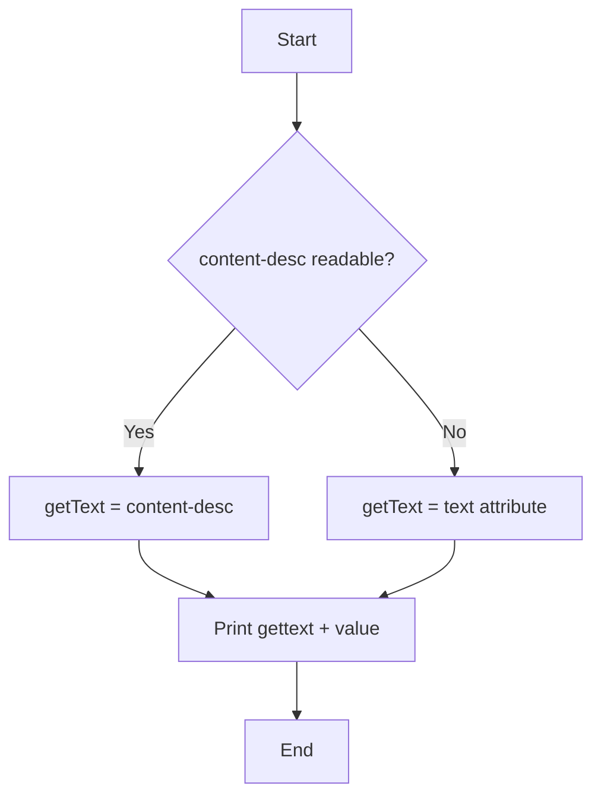

### `WEBGETTEXT`
> Reads visible web text via getText, stores in `webGetText`, prints debug.
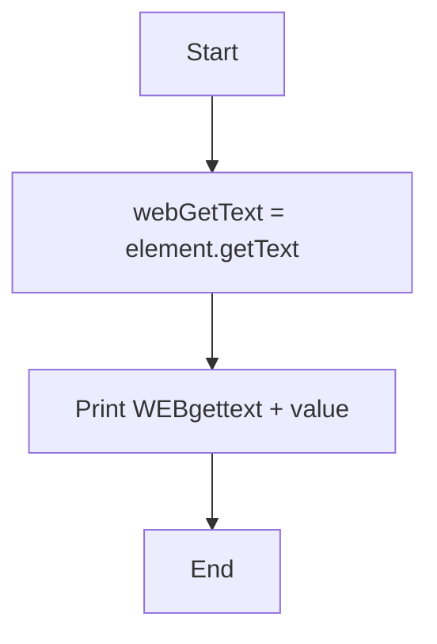

### `UPDATEAPPLICANTNAME`
> Extracts the first word of the last captured text into `applicantName`.
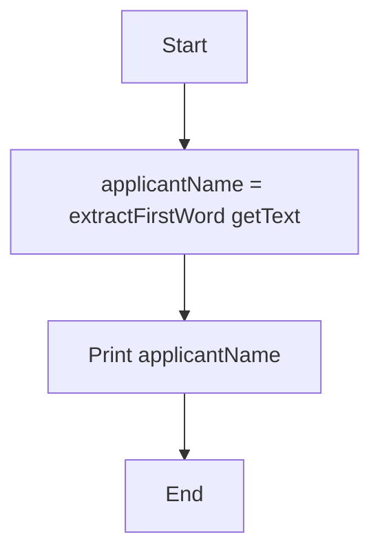

### `UPDATECOAPPLICANTNAME`
> Extracts first word of captured text into `coApplicantName`.
```mermaid
flowchart TD
    A[Start] --> B[coApplicantName = extractFirstWord getText]
    B --> C[Print coApplicantName]
    C --> D[End]
```

### `UPDATEGUARANTORNAME`
> Extracts first word of captured text into `guarantorName`.
```mermaid
flowchart TD
    A[Start] --> B[guarantorName = extractFirstWord getText]
    B --> C[Print guarantorName]
    C --> D[End]
```

### `UPDATECONTRACTNUMBER`
> Stores whole captured text into `contractNumber` and logs it.
```mermaid
flowchart TD
    A[Start] --> B[contractNumber = getText]
    B --> C[Log ContractNumber]
    C --> D[End]
```

### `ENTERCONTRACTNUMBER`
> Null-checks element then types the stored `contractNumber`.
```mermaid
flowchart TD
    A[Start] --> B{element null?}
    B -- Yes --> C[Log error and return]
    B -- No --> D[element.sendKeys contractNumber]
    D --> E[End]
```

### `UPDATETHREEPERSONANAME`
> Splits the sheet value by space into applicant, co-applicant, guarantor names in one shot.
```mermaid
flowchart TD
    A[Start] --> B[Split dataSheet2Value by space]
    B --> C[applicantName = index 0]
    C --> D[coApplicantName = index 1]
    D --> E[guarantorName = index 2]
    E --> F[End]
```

---

# 5) Application ID Store/Update

### `STOREAPPLICATIONID`
> Creates the Excel store, parses applicationID out of the generated text (between ':' and 'generated!'), then writes id + scenario + vertical to Excel.
```mermaid
flowchart TD
    A[Start] --> B[CreateExcelSheetToStoreApplicationID]
    B --> C[Parse applicationID substring from getText]
    C --> D[writeApplicationIDToExcel row + id + ScenarioNo + VerticalName]
    D --> E[Print + log applicationID]
    E --> F[End]
```

### `UPDATEAPPLICATIONID`
> Reads back the Excel store and re-assigns applicationID for the current row index.
```mermaid
flowchart TD
    A[Start] --> B[readApplicationIDToExcel]
    B --> C[applicationID = assignApplicationId rowCount-1]
    C --> D[Print applicationID]
    D --> E[End]
```

---

# 6) Session Teardown

### `QUIT`
> If driver exists: for Mobile, terminate app + stop Appium server; always quit driver in finally.
```mermaid
flowchart TD
    A[Start] --> B{driver != null?}
    B -- No --> C[End]
    B -- Yes --> D{Platform Mobile?}
    D -- Yes --> E[terminateApp + fnStopAppiumServer]
    D -- No --> F[Skip]
    E --> G[finally: driver.quit]
    F --> G
    E -.catch.-> H[Print/log termination failed]
    H --> G
    G --> I[End]
```

---

# 7) Click Family

### `CLICK`
> Guards on `elementFoundByLocator`; if not found skips immediately, else waits until clickable (full ExplicitWait) and clicks. Exceptions bubble to LocatorManager retry. (Navigation action)
```mermaid
flowchart TD
    A[Start] --> B{LocatorManager.elementFoundByLocator?}
    B -- No --> C[Warn and skip immediately]
    B -- Yes --> D[Wait until element clickable]
    D --> E[element.click]
    D -.catch.-> F[Rethrow to LocatorManager retry loop]
    E --> G[End]
```

### `JAVASCRIPTCLICK`
> Casts driver to JavascriptExecutor and runs arguments[0].click(). (Navigation action)
```mermaid
flowchart TD
    A[Start] --> B[Cast driver to JavascriptExecutor]
    B --> C[Run arguments 0 .click JS]
    C --> D[End]
```

### `CHECKANDCLICK`
> For Web waits for page ready; logs start; waits visibility (10s) by XPath and clicks. On timeout/not-found/intercepted it warns and continues (soft-skip). (Navigation action)
```mermaid
flowchart TD
    A[Start] --> B{Platform Web?}
    B -- Yes --> C[waitForPageReady]
    B -- No --> D[Skip page wait]
    C --> E[logActionStart]
    D --> E
    E --> F[Wait visibility by XPath 10s then click]
    F --> G[logActionSuccess]
    F -.catch timeout/notfound/intercepted.-> H[Warn + print Element is not There]
    G --> I[End]
    H --> I
```

### `MOUSEHOVER`
> Moves mouse to the element (hover) using Actions.
```mermaid
flowchart TD
    A[Start] --> B[act = new Actions]
    B --> C[moveToElement element .build .perform]
    C --> D[End]
```

### `MOUSEHOVERCLICK`
> Hovers over element and clicks in the same Actions chain.
```mermaid
flowchart TD
    A[Start] --> B[act = new Actions]
    B --> C[moveToElement element .click .perform]
    C --> D[End]
```

### `ACCESSIBILITYID_CLICK`
> Waits for visibility by accessibility id (10s) then clicks.
```mermaid
flowchart TD
    A[Start] --> B[Wait visibility by accessibilityId dataSheet2Value 10s]
    B --> C[Click found element]
    C --> D[End]
```

### `CLICKONPERSONA`
> Clicks an Android Button whose content-desc equals the sheet value.
```mermaid
flowchart TD
    A[Start] --> B[Find Button content-desc == dataSheet2Value]
    B --> C[Click]
    C --> D[End]
```

### `SELECTCO_APPLICANTORGUARANTOR`
> Clicks an Android Button whose content-desc contains the sheet value.
```mermaid
flowchart TD
    A[Start] --> B[Find Button content-desc contains dataSheet2Value]
    B --> C[Click]
    C --> D[End]
```

### `CLICKONAPPLICATIONID`
> Loops the resolved elements, prints each text, clicks the one equal to applicationID and stops.
```mermaid
flowchart TD
    A[Start] --> B[For each element in elements]
    B --> C[Read AppID text]
    C --> D{AppID == applicationID?}
    D -- Yes --> E[Click + break]
    D -- No --> F[Next element]
    F --> B
    E --> G[End]
```

### `CLICKONPERTICULARAPPLICATIONID`
> Waits for all matching elements (15s), iterates, and clicks whichever text equals applicationID (logs candidates).
```mermaid
flowchart TD
    A[Start] --> B[Wait presence of all by XPath 15s]
    B --> C[Log candidate count]
    C --> D[For each candidate]
    D --> E{text == applicationID?}
    E -- Yes --> F[Click + log matched]
    E -- No --> G[Next]
    G --> D
    F --> H[End]
```

### `CPC_CASEASSIGN_CROSSBUTTON`
> Simple direct click on the XPath from PropertyValue.
```mermaid
flowchart TD
    A[Start] --> B[Find by PropertyValue XPath]
    B --> C[Click]
    C --> D[End]
```

---

# 8) Clear / JS Input Family

### `GETATTRIBUTEVALUE`
> Asserts element then prints its DOM 'value' property.
```mermaid
flowchart TD
    A[Start] --> B[assert element not null]
    B --> C[Print element.getDomProperty value]
    C --> D[End]
```

### `CLEAR`
> Asserts element then clears the field.
```mermaid
flowchart TD
    A[Start] --> B[assert element not null]
    B --> C[element.clear]
    C --> D[End]
```

### `JS_CLEARSENDKEYS`
> Uses the native value setter to set the field value and dispatches an 'input' event (React-safe update).
```mermaid
flowchart TD
    A[Start] --> B[Get native value setter from prototype]
    B --> C[setter.call element, dataSheet2Value]
    C --> D[Dispatch input event bubbles=true]
    D --> E[End]
```

### `CLEARANDUPDATEVALUEUSINGJAVASCRIPT`
> Delegates to WebScrolling.ClearFieldUsingJavaScript with driver, element, value.
```mermaid
flowchart TD
    A[Start] --> B[WebScrolling.ClearFieldUsingJavaScript driver, element, dataSheet2Value]
    B --> C[End]
```

---

# 9) Mobile App Control & Media

### `OPENAPP_USINGONLYAPPPACKAGE`
> Activates app by package name and forces PORTRAIT orientation.
```mermaid
flowchart TD
    A[Start] --> B[activateApp App_PackageName]
    B --> C[rotate PORTRAIT]
    C --> D[End]
```

### `TERMINATEAPP_USINGONLYAPPPACKAGE`
> Terminates the app by package name.
```mermaid
flowchart TD
    A[Start] --> B[terminateApp App_PackageName]
    B --> C[End]
```

### `CAMERAIMAGEINJECTION`
> Runs BrowserStack camera image injection executor with a media:// URL from the sheet.
```mermaid
flowchart TD
    A[Start] --> B[Build browserstack_executor cameraImageInjection JSON]
    B --> C[executeScript with media:// + dataSheet2Value]
    C --> D[End]
```

### `PUSHFILETOBROWSERSTACKDEVICE`
> Pushes a local data-sheet-folder file to the device /sdcard/Download path.
```mermaid
flowchart TD
    A[Start] --> B[Resolve local file from dataSheetFolderPath + name]
    B --> C[pushFile to /sdcard/Download/name]
    C --> D[End]
```

### `SELECTUPLOADFILE`
> Clicks a native element whose text matches the sheet value (file picker item).
```mermaid
flowchart TD
    A[Start] --> B[Find by text == dataSheet2Value]
    B --> C[Click]
    C --> D[End]
```

### `REMOVEAPPLICATIONUSINGBUNDLEID`
> Removes/uninstalls the app using the configured AppPath.
```mermaid
flowchart TD
    A[Start] --> B[removeApp MobileConfiguration.AppPath]
    B --> C[End]
```

---

# 10) Random Number & MPIN

### `GENERATERANDOMNUMBER`
> Generates a random number with the requested digit count and stores in `randomNumber`.
```mermaid
flowchart TD
    A[Start] --> B[numDigits = parse dataSheet2Value]
    B --> C[min = 10^ numDigits-1, max = 10^numDigits - 1]
    C --> D[randomNumber = min + random in range]
    D --> E[Print random number]
    E --> F[End]
```

### `MPIN`
> Types the previously generated randomNumber as the MPIN into the element.
```mermaid
flowchart TD
    A[Start] --> B[mpin = String.valueOf randomNumber]
    B --> C[assert element not null]
    C --> D[element.sendKeys mpin]
    D --> E[End]
```

---

# 11) Validation Family

### `CHECKVISIBILITY`
> If verify flag true: checks element.isDisplayed(); on success mark PASS, on exception mark FAIL and increment fail counters.
```mermaid
flowchart TD
    A[Start] --> B{dataSheet2Value == true?}
    B -- No --> C[Skip]
    B -- Yes --> D[Try element.isDisplayed]
    D --> E{Displayed?}
    E -- Yes --> F[status=PASS + passTestCase]
    E -- No/exception --> G[status=FAIL + fail++ + failedValidations++ + failTestCase]
    F --> H[End]
    G --> H
    C --> H
```

### `ISENABLE`
> Same pattern as CHECKVISIBILITY but checks element.isEnabled().
```mermaid
flowchart TD
    A[Start] --> B{dataSheet2Value == true?}
    B -- No --> C[Skip]
    B -- Yes --> D[Try element.isEnabled]
    D --> E{Enabled?}
    E -- Yes --> F[status=PASS + passTestCase]
    E -- No/exception --> G[status=FAIL + failedValidations++ + failTestCase]
    F --> H[End]
    G --> H
    C --> H
```

---

# 12) Navigation / Keyboard Keys

### `BACKPAGE`
> Loops up to 10 times: if the target XPath becomes visible (3s wait) break, else press Android BACK.
```mermaid
flowchart TD
    A[Start] --> B[Loop i = 0..9]
    B --> C[Wait visibility of PropertyValue 3s]
    C --> D{Visible?}
    D -- Yes --> E[Break]
    D -- No/exception --> F[Press Android BACK]
    F --> G[Next iteration]
    G --> B
    E --> H[End]
```

### `GOBACK`
> Presses the Android BACK key once.
```mermaid
flowchart TD
    A[Start] --> B[Press Android BACK]
    B --> C[End]
```

### `HIDEKEYBOARDUSINGENTERKEY`
> If keyboard is shown, presses ENTER to dismiss.
```mermaid
flowchart TD
    A[Start] --> B{Keyboard shown?}
    B -- Yes --> C[Press Android ENTER]
    B -- No --> D[Skip]
    C --> E[End]
    D --> E
```

### `HIDEKEYBOARDIFITOPEN` / `HIDEKEYBOARD`
> If keyboard is shown, presses BACK to dismiss.
```mermaid
flowchart TD
    A[Start] --> B{Keyboard shown?}
    B -- Yes --> C[Press Android BACK]
    B -- No --> D[Skip]
    C --> E[End]
    D --> E
```

### `NAVIGATEBACK`
> Browser back navigation. (Navigation action)
```mermaid
flowchart TD
    A[Start] --> B[driver.navigate.back]
    B --> C[End]
```

### `PAGEREFRESH`
> Browser refresh. (Navigation action)
```mermaid
flowchart TD
    A[Start] --> B[driver.navigate.refresh]
    B --> C[End]
```

### `SELECTNEXTMONTH`
> Computes next month name from today and clicks it by accessibility id (calendar/date picker).
```mermaid
flowchart TD
    A[Start] --> B[nextMonthDate = today.plusMonths 1]
    B --> C[nextMonth = full month display name]
    C --> D[Click by accessibilityId nextMonth]
    D --> E[End]
```

---

# 13) Search Application Family

### `SEARCHAPPLICATION`
> Types the runtime applicationID into the current element (search box).
```mermaid
flowchart TD
    A[Start] --> B[assert element not null]
    B --> C[element.sendKeys applicationID]
    C --> D[End]
```

### `CLICKONSEARCHAPPLICATION`
> Waits for a mobile card whose content-desc contains 'ID: applicationID' (15s) and clicks it.
```mermaid
flowchart TD
    A[Start] --> B[Wait visibility content-desc contains ID: applicationID 15s]
    B --> C[Click]
    C --> D[End]
```

### `CLICKONSEARCHLEADID`
> Same as above but uses the sheet value as the lead id.
```mermaid
flowchart TD
    A[Start] --> B[Wait visibility content-desc contains ID: dataSheet2Value 15s]
    B --> C[Click]
    C --> D[End]
```

### `AGAINCLICKONSEARCHBAR`
> Clicks search button by aria-label containing applicationID, waits for either primary or fallback search input, then sends ENTER to whichever is available.
```mermaid
flowchart TD
    A[Start] --> B[Click button aria-label contains applicationID]
    B --> C[Wait either primary or fallback search input 10s]
    C --> D{Primary input available?}
    D -- Yes --> E[Send ENTER to primary]
    D -- No --> F[Send ENTER to fallback]
    E --> G[End]
    F --> G
```

---

# 14) Popup / Business Flow Family

### `PENNYDROP`
> Primary path: click Retry, Retry again, then Okay. On any failure fallback: click CheckBox then Proceed.
```mermaid
flowchart TD
    A[Start] --> B[Wait 10s]
    B --> C[Click Retry]
    C --> D[Click Retry again]
    D --> E[Click Okay]
    E --> F[Done]
    C -.catch.-> G[Fallback]
    D -.catch.-> G
    E -.catch.-> G
    G --> H[Click CheckBox]
    H --> I[Click Proceed]
    I --> F
```

### `DEDUPE`
> Try Select then Proceed. On catch: try 'No Match'; if that is missing, click Proceed.
```mermaid
flowchart TD
    A[Start] --> B[Click Select]
    B --> C[Click Proceed]
    C --> D[Done]
    B -.catch.-> E[Try No Match]
    C -.catch.-> E
    E --> F{No Match present?}
    F -- Yes --> D
    F -- No --> G[Click Proceed]
    G --> D
```

### `DEDUPE_PL`
> Try select then Proceed; on catch just click Proceed (simpler than DEDUPE, lowercase 'select').
```mermaid
flowchart TD
    A[Start] --> B[Click select]
    B --> C[Click Proceed]
    C --> D[Done]
    B -.catch.-> E[Fallback click Proceed]
    C -.catch.-> E
    E --> D
```

### `OFFERPOPUP`
> Try to detect Insurance Add-ons offer popup. If exception (popup not there) → catch checks 'Generating Offers'; if visible click Back to Home then the In-Progress Sanction card.
```mermaid
flowchart TD
    A[Start] --> B[Wait Insurance Add-ons popup 10s]
    B --> C{Popup found in try?}
    C -- Yes --> D[Print fallback warning - no recovery step]
    C -- No/exception --> E[Catch branch]
    E --> F[Wait Generating Offers 5s]
    F --> G{Generating Offers visible?}
    G -- Yes --> H[Click Back to Home]
    H --> I[Wait + click In Progress Sanction card]
    G -- No/exception --> J[Print neither popup nor generating found]
```

### `DETAILSINCOMPLETEPOPUP`
> Wait for 'Details Incomplete', click Proceed, wait clickable Proceed, click again. On catch log popup not shown and continue.
```mermaid
flowchart TD
    A[Start] --> B[Wait Details Incomplete visible 10s]
    B --> C[Click Proceed]
    C --> D[Wait clickable Proceed]
    D --> E[Click Proceed again]
    E --> F[Done]
    B -.catch.-> G[Log popup not shown + continue]
    G --> F
```

### `KYCVERIFY`
> Try the 2nd matched input (PropertyValue+[2]) click+type; on failure fallback to 1st input (PropertyValue+[1]).
```mermaid
flowchart TD
    A[Start] --> B[secondInput = PropertyValue + index 2]
    B --> C[Wait clickable secondInput + click]
    C --> D[Wait visible secondInput + sendKeys dataSheet2Value]
    D --> E[Done]
    C -.catch.-> F[firstInput = PropertyValue + index 1]
    D -.catch.-> F
    F --> G[Wait clickable firstInput + click]
    G --> H[Wait visible firstInput + sendKeys dataSheet2Value]
    H --> E
```

### `INITILISEDDUPLICATEPERSONALISTDETAILS`
> Initializes the two duplicate-persona tracking HashMaps.
```mermaid
flowchart TD
    A[Start] --> B[duplicatePersonaListDetails = new HashMap]
    B --> C[LogicalUserQCduplicatePersonaListDetails = new HashMap]
    C --> D[End]
```

### `HOMEPAGECHECK`
> Loop up to 10 times: if 'Applications Tab 2 of 3' visible (3s) break, else press Android BACK.
```mermaid
flowchart TD
    A[Start] --> B[Loop i = 0..9]
    B --> C[Wait accessibilityId Applications Tab 2 of 3 3s]
    C --> D{Visible?}
    D -- Yes --> E[Break]
    D -- No/exception --> F[Press Android BACK]
    F --> G[Next iteration]
    G --> B
    E --> H[End]
```

---

# 15) Salesforce (SFDC/CPC) Flows

### `CLICKONCPCMOREBUTTON`
> Try clicking the 5th 'More Tabs' button; on failure fallback to the 3rd.
```mermaid
flowchart TD
    A[Start] --> B[Try click More Tabs index 5]
    B --> C[Done]
    B -.catch.-> D[Fallback click More Tabs index 3]
    D --> C
```

### `CPC_BANKINGDETAILS`
> Try span 'Banking Details' index 2; on catch try plain span; on catch fallback to anchor 'Banking Details'.
```mermaid
flowchart TD
    A[Start] --> B[Try span Banking Details index 2]
    B --> C[Done]
    B -.catch.-> D[Try span Banking Details]
    D --> C
    D -.catch.-> E[Fallback anchor Banking Details]
    E --> C
```

---

# 16) Scroll / Swipe Family

### `UNTILSCROLLDOWNELEMENTVIEW`
> Loop up to 15 times: find element; if displayed stop; else swipe DOWN (Y 60% → 35%). Throw NoSuchElement if never visible.
```mermaid
flowchart TD
    A[Start] --> B[Init maxScrollCount=15, scrollCount=0]
    B --> C{Find element by PropertyValue XPath?}
    C -- Yes --> D{isDisplayed?}
    D -- Yes --> E[isElementVisible=true + stop]
    D -- No --> F[Continue]
    C -- No/exception --> G[scrollCount++]
    F --> G
    G --> H[W3C swipe down Y 60% to 35% 300ms]
    H --> I{scrollCount < 15 and not visible?}
    I -- Yes --> C
    I -- No --> J[Throw NoSuchElementException]
    E --> K[End]
```

### `SCROLLDOWNLITTLEBIT`
> Single small W3C swipe (Y 60% → 50%) over 600ms.
```mermaid
flowchart TD
    A[Start] --> B[Get screen width/height]
    B --> C[Build swipe 60% to 50%]
    C --> D[Perform W3C swipe 600ms]
    D --> E[End]
```

### `UNTILSCROLLUPELEMENTVIEW`
> Same as scroll-down variant but swipes UP (Y 35% → 60%) each attempt.
```mermaid
flowchart TD
    A[Start] --> B[Init maxScrollCount=15, scrollCount=0]
    B --> C{Find element by PropertyValue XPath?}
    C -- Yes --> D{isDisplayed?}
    D -- Yes --> E[isElementVisible=true + stop]
    D -- No --> F[Continue]
    C -- No/exception --> G[scrollCount++]
    F --> G
    G --> H[W3C swipe up Y 35% to 60% 300ms]
    H --> I{scrollCount < 15 and not visible?}
    I -- Yes --> C
    I -- No --> J[Throw NoSuchElementException]
    E --> K[End]
```

### `SCROLLUPDOWNELEMENTUNTILLVISIABLE`
> Bidirectional smart scroll (max 30). Detects screen edge via page-source comparison and reverses direction; also toggles at half count. Small correction swipe if element near bottom.
```mermaid
flowchart TD
    A[Start] --> B[Init max=30, count=0, direction=down, prevSource=empty]
    B --> C{Find element by PropertyValue XPath?}
    C -- Yes --> D{Displayed?}
    D -- Yes --> E{Near bottom <=25%?}
    E -- Yes --> F[Correction swipe 60% to 50%]
    E -- No --> G[Position accepted]
    F --> H[Stop]
    G --> H
    D -- No --> I[Go to swipe branch]
    C -- No/exception --> I
    I --> J{Direction down?}
    J -- Yes --> K[Capture prev source, swipe Y 60% to 45%]
    J -- No --> L[Capture prev source, swipe Y 45% to 60%]
    K --> M[Capture new page source]
    L --> M
    M --> N{newSource == prevSource?}
    N -- Yes --> O[Reverse direction - edge reached]
    N -- No --> P[Keep direction]
    O --> Q{count == max/2?}
    P --> Q
    Q -- Yes --> R[Toggle direction]
    Q -- No --> S[No toggle]
    R --> T[count++]
    S --> T
    T --> U{count < 30 and not found?}
    U -- Yes --> C
    U -- No --> V[Log element not found]
```

### `SWIPELEFTUNTILELEMENTFOUND`
> Loop up to 5 times: if element displayed print found + break; else swipe LEFT (X 80% → 20% at center Y).
```mermaid
flowchart TD
    A[Start] --> B[Init maxSwipes=5, attempt=0]
    B --> C{Find XPath element?}
    C -- Yes --> D{Displayed?}
    D -- Yes --> E[Print Element found + break]
    D -- No --> F[Swipe left]
    C -- No/exception --> F
    F --> G[W3C swipe X 80% to 20% at center Y + attempt++]
    G --> H{attempt < 5?}
    H -- Yes --> C
    H -- No --> I[Print not found after 5 swipes]
    E --> J[End]
```

### `TAPELEMENTCENTER`
> Guard element null/not-displayed; compute rect center; W3C tap exactly at center coordinates.
```mermaid
flowchart TD
    A[Start] --> B{element != null and displayed?}
    B -- No --> C[Print skip + return]
    B -- Yes --> D[Read element rect]
    D --> E[centerX, centerY]
    E --> F[Build W3C tap sequence]
    F --> G[Tap at center]
    G --> H[End]
```

### `HORIZONTALSCROLL`
> Resolve persona token → runtime name. Inside container, alternate left/right swipes (max 10); reverse direction when container X doesn't change (edge). Click target button when its content-desc starts-with the name.
```mermaid
flowchart TD
    A[Start] --> B[Resolve persona token applicant/coApplicant/guarantor]
    B --> C[Find horizontal container by PropertyValue]
    C --> D[Init maxScroll=10, direction=left]
    D --> E{Button starts-with persona found + displayed?}
    E -- Yes --> F[Click target + stop]
    E -- No --> G[Store oldX]
    G --> H{direction left?}
    H -- Yes --> I[performHorizontalSwipe left]
    H -- No --> J[performHorizontalSwipe right]
    I --> K[Sleep 300ms + scrollCount++]
    J --> K
    K --> L[Read newX]
    L --> M{oldX == newX?}
    M -- Yes --> N[Reverse direction]
    M -- No --> O[Keep direction]
    N --> P{scrollCount < 10?}
    O --> P
    P -- Yes --> E
    P -- No --> Q[Print not found after alternating scrolls]
    F --> R[End]
```

---

# 17) Persona Handling & Persona Scroll

### `CPVSCROLL`
> Resolve persona token → runtime name. Loop up to 12: find persona button; if displayed do a correction swipe when near bottom then click, else click directly. Swipe down for first half, up for second half.
```mermaid
flowchart TD
    A[Start] --> B[Resolve persona token to runtime name]
    B --> C[Init maxScrollCount=12, count=0]
    C --> D{Find persona button XPath?}
    D -- Yes --> E{Displayed?}
    E -- Yes --> F{Near bottom <=25%?}
    F -- Yes --> G[Correction swipe 60% to 50% then click]
    F -- No --> H[Click directly]
    E -- No --> I[Go swipe phase]
    D -- No/exception --> I
    G --> J[Stop]
    H --> J
    I --> K{count < max/2?}
    K -- Yes --> L[Swipe down 60% to 45%]
    K -- No --> M[Swipe up 45% to 60%]
    L --> N[count++]
    M --> N
    N --> O{count < 12 and not clicked?}
    O -- Yes --> D
    O -- No --> P[Print scrolling limit completed]
    J --> Q[End]
```

---

# 18) Dropdown / Select Family

### `SELECTDROPDOWNVALUE`
> If no scrollable container found → direct click by accessibilityId. Else loop up to 15: if option visible click + stop, else swipe inside dropdown (Y 80% → 20%).
```mermaid
flowchart TD
    A[Start] --> B[Try find dropdown scrollable by PropertyValue]
    B --> C{Scrollable present?}
    C -- No --> D[Direct click by accessibilityId dataSheet2Value + break]
    C -- Yes --> E[Init scrollCount=0 max=15]
    E --> F{Option visible by accessibilityId?}
    F -- Yes --> G[Click option + sleep + stop]
    F -- No --> H[scrollCount++]
    H --> I[Swipe inside dropdown 80% to 20%]
    I --> J{scrollCount < 15?}
    J -- Yes --> F
    J -- No --> K[End without hard throw]
    D --> K
    G --> K
```

### `SELECTVISIBLETEXT`
> Selenium Select → selectByVisibleText.
```mermaid
flowchart TD
    A[Start] --> B[assert element not null]
    B --> C[new Select element]
    C --> D[selectByVisibleText dataSheet2Value]
    D --> E[End]
```

### `SELECTBYVALUE`
> Selenium Select → selectByValue (with a 3s sleep before).
```mermaid
flowchart TD
    A[Start] --> B[assert element not null]
    B --> C[new Select element]
    C --> D[Sleep 3000ms]
    D --> E[selectByValue dataSheet2Value]
    E --> F[End]
```

### `SELECTBYINDEX`
> Selenium Select → selectByIndex (parsed int).
```mermaid
flowchart TD
    A[Start] --> B[assert element not null]
    B --> C[new Select element]
    C --> D[selectByIndex parseInt dataSheet2Value]
    D --> E[End]
```

---

# 19) Frame / Window Family

### `FRAMESWITCHUSINGLOCATOR`
> Switches into the iframe using the current element.
```mermaid
flowchart TD
    A[Start] --> B[driver.switchTo.frame element]
    B --> C[End]
```

### `DEFAULTCONTENT`
> Switches back to the main document.
```mermaid
flowchart TD
    A[Start] --> B[driver.switchTo.defaultContent]
    B --> C[End]
```

### `PARENTFRAME`
> Switches to the parent frame.
```mermaid
flowchart TD
    A[Start] --> B[driver.switchTo.parentFrame]
    B --> C[End]
```

### `FRAMECOUNT`
> Prints the number of iframe elements resolved.
```mermaid
flowchart TD
    A[Start] --> B[count = elements]
    B --> C[Print iframe size]
    C --> D[End]
```

---

# 20) Web Scroll Utilities

### `SCROLLWEBELEMENTUNTILVISIBLECENTER`
> Wait page ready, then delegate to WebScrolling.ScrollwebElementUntilVisible.
```mermaid
flowchart TD
    A[Start] --> B[waitForPageReady]
    B --> C[WebScrolling.ScrollwebElementUntilVisible driver, element]
    C --> D[End]
```

### `SCROLLWEBELEMENTUNTILVISIBLE`
> Wait page ready, then JS scrollIntoView on the element.
```mermaid
flowchart TD
    A[Start] --> B[waitForPageReady]
    B --> C[JS scrollIntoView on element]
    C --> D[End]
```

---

# 21) BrowserStack AI

### `BROWSERSTACKAI`
> Runs BrowserStack 'ai' executor with the PropertyValue instruction, retries up to 3 times (with sleeps), succeeds when response contains execution_status completed; else throws RuntimeException.
```mermaid
flowchart TD
    A[Start] --> B[Build browserstack_executor ai command with PropertyValue]
    B --> C[success=false, attempt=1]
    C --> D[Sleep 3000ms + executeScript]
    D --> E{Response contains execution_status completed?}
    E -- Yes --> F[success=true + break]
    E -- No/exception --> G[Log attempt result + sleep 2000ms]
    G --> H{attempt < 3?}
    H -- Yes --> I[attempt++]
    I --> D
    H -- No --> J{success?}
    F --> J
    J -- Yes --> K[End OK]
    J -- No --> L[Throw RuntimeException after 3 attempts]
```

---

# 22) SuperApp Custom Functions

### `SELECT_AUTOCOMPLETE_DROPDOWN`
> Wait page ready; wait li[role=option] with exact text; scroll to center; wait clickable; normal click with JS-click fallback.
```mermaid
flowchart TD
    A[Start] --> B[waitForPageReady]
    B --> C[Wait presence li role option + normalized text]
    C --> D[Scroll option into center]
    D --> E[Wait clickable]
    E --> F{Normal click works?}
    F -- Yes --> G[Done]
    F -- No --> H[Fallback JS click]
    H --> G
```

### `WAIT_FOR_ELEMENT_VISIBLE`
> Wait page ready, then wait up to 300s for visibility of the XPath element.
```mermaid
flowchart TD
    A[Start] --> B[waitForPageReady]
    B --> C[timeout = 300s]
    C --> D[Wait visibility of PropertyValue]
    D --> E[End]
```

### `UNCHECK_IF_CHECKED`
> Wait page ready; loop elements from index 1 and click each to uncheck (100ms sleep each).
```mermaid
flowchart TD
    A[Start] --> B[waitForPageReady]
    B --> C[Loop i = 1..elements.size-1]
    C --> D[Click element i - uncheck]
    D --> E[Sleep 100ms]
    E --> F{More elements?}
    F -- Yes --> C
    F -- No --> G[End]
```

### `SELECT_LISTBOX`
> Wait page ready; wait li[role=option] with normalized text clickable; click.
```mermaid
flowchart TD
    A[Start] --> B[waitForPageReady]
    B --> C[Wait clickable li role option + normalized text]
    C --> D[Click option]
    D --> E[End]
```

### `SCROLL_SELECTLISTBOX`
> Wait li with normalized text visible; JS scroll into center; click.
```mermaid
flowchart TD
    A[Start] --> B[Wait visible li normalized text]
    B --> C[JS scrollIntoView center]
    C --> D[Click option]
    D --> E[End]
```

### `DIGILOCKER_PIN`
> Delegates to sendOtpPin(pin, idPrefix): for each digit find field by id(idPrefix+index), click to focus, type single digit, sleep 100ms.
```mermaid
flowchart TD
    A[Start] --> B[sendOtpPin pin, idPrefix]
    B --> C[For each pin digit]
    C --> D[Find field by id idPrefix + index+1]
    D --> E[Click field for focus]
    E --> F[Send single digit]
    F --> G[Sleep 100ms]
    G --> H{More digits?}
    H -- Yes --> C
    H -- No --> I[End]
```

---

# 23) Dynamic (default) Actions

The `default` branch handles **pattern-based** actions (name contains a keyword + embedded digits). Digits inside `(...)` are pulled by `getOnlyDigit()`; otherwise all non-digits are stripped.

### `WAIT` (e.g. `WAIT2000`)
> Strips digits from the action name and sleeps that many milliseconds.
```mermaid
flowchart TD
    A[Start] --> B{Action contains WAIT?}
    B -- Yes --> C[digits = strip non-digits]
    C --> D[Thread.sleep digits]
    D --> E[handled=true]
```

### `WindowHandelByIndex(n)`
> Extracts index n, lists window handles, switches to that window. (also flips pageNavigated=true)
```mermaid
flowchart TD
    A[Start] --> B[digit = getOnlyDigit Action]
    B --> C[Get all window handles]
    C --> D[switchTo.window handles.get n]
    D --> E[End]
```

### `FRAMEINDEX(n)`
> Extracts index n and switches to that frame by index.
```mermaid
flowchart TD
    A[Start] --> B[digit = getOnlyDigit Action]
    B --> C[switchTo.frame index n]
    C --> D[End]
```

### `ScrollDown(n)` / `ScrollUp(n)`
> Extracts count n, delegates to WebScrolling.scrollDown / scrollUp.
```mermaid
flowchart TD
    A[Start] --> B[digit = getOnlyDigit Action]
    B --> C{Down or Up?}
    C -- Down --> D[WebScrolling.scrollDown driver, n]
    C -- Up --> E[WebScrolling.scrollUp driver, n]
    D --> F[End]
    E --> F
```

### `scrollwebElementUpAndDownUntilVisible(n)`
> Strips digits as scroll count, delegates to WebScrolling.ScrollUpAndDownwebElementUntilVisible with PropertyValue.
```mermaid
flowchart TD
    A[Start] --> B[Scroll = strip digits]
    B --> C[WebScrolling.ScrollUpAndDownwebElementUntilVisible driver, PropertyValue, Scroll]
    C --> D[End]
```

### `UniversalPerfectScrollUpAndDownWebElementUntilVisible(n)`
> Same idea, calls the Universal variant.
```mermaid
flowchart TD
    A[Start] --> B[Scroll = strip digits]
    B --> C[WebScrolling.UniversalPerfectScrollUpAndDownWebElementUntilVisible driver, PropertyValue, Scroll]
    C --> D[End]
```

### Unknown / Unhandled action
> If no pattern matched, logs a warning with Action, SI_No, ScenarioID and prints to console.
```mermaid
flowchart TD
    A[Start] --> B{Any pattern matched?}
    B -- Yes --> C[handled=true]
    B -- No --> D[Warn Unknown action + print SI_No]
    C --> E[End]
    D --> E
```

---

# 24) Helper Methods

| Method | Purpose |
|--------|---------|
| `getOnlyDigit(Action)` | Extracts digits inside parentheses `(123)` via regex |
| `ensureElementPresent(actionName)` | Null-safe guard; logs error + returns false if `element == null` |
| `logActionStart / logActionSuccess` | Standard start/success info logging |
| `extractFirstWord(source, actionName)` | Returns first space-delimited word; safe on empty/no-space text |
| `performHorizontalSwipe(driver, startX, endX, startY)` | Reusable W3C horizontal swipe used by HORIZONTALSCROLL |
| `sendOtpPin(pin, idPrefix)` | Types each PIN digit into sequential `id = idPrefix+index` fields |

---

# ✅ Coverage Checklist (all switch cases documented)

**Lifecycle:** MONITORING_PROPERTIES, START_APPLICATION, INSTALLANDSTARTAPPLICATION, STARTBROWSER, NEWWINDOWBROWSWRTAB
**URL/Source:** BROWSERURL, GETPAGESOURCE
**SendKeys:** SENDKEYSUSING_CONFIGVALUE, SENDKEYSANDENTERKEY, ELEMENTWITHENTERKEY, APPLICATIONIDSEARCHONSFDC, KEYBOARDSENDKEYS, SENDKEYS, SAPCODE_SENDKEYS, PASSWORD_SENDKEYS, CLICKCLEARSENDKEYS
**Capture:** APPVERSION, MOBILEGETTEXT, WEBGETTEXT, UPDATEAPPLICANTNAME, UPDATECOAPPLICANTNAME, UPDATEGUARANTORNAME, UPDATECONTRACTNUMBER, ENTERCONTRACTNUMBER, UPDATETHREEPERSONANAME
**App ID:** STOREAPPLICATIONID, UPDATEAPPLICATIONID
**Teardown:** QUIT
**Click:** CLICK, JAVASCRIPTCLICK, CHECKANDCLICK, MOUSEHOVER, MOUSEHOVERCLICK, ACCESSIBILITYID_CLICK, CLICKONPERSONA, SELECTCO_APPLICANTORGUARANTOR, CLICKONAPPLICATIONID, CLICKONPERTICULARAPPLICATIONID, CPC_CASEASSIGN_CROSSBUTTON
**Clear/JS:** GETATTRIBUTEVALUE, CLEAR, JS_CLEARSENDKEYS, CLEARANDUPDATEVALUEUSINGJAVASCRIPT
**App/Media:** OPENAPP_USINGONLYAPPPACKAGE, TERMINATEAPP_USINGONLYAPPPACKAGE, CAMERAIMAGEINJECTION, PUSHFILETOBROWSERSTACKDEVICE, SELECTUPLOADFILE, REMOVEAPPLICATIONUSINGBUNDLEID
**Random/MPIN:** GENERATERANDOMNUMBER, MPIN
**Validation:** CHECKVISIBILITY, ISENABLE
**Nav/Keys:** BACKPAGE, GOBACK, HIDEKEYBOARDUSINGENTERKEY, HIDEKEYBOARDIFITOPEN, HIDEKEYBOARD, NAVIGATEBACK, PAGEREFRESH, SELECTNEXTMONTH
**Search:** SEARCHAPPLICATION, CLICKONSEARCHAPPLICATION, CLICKONSEARCHLEADID, AGAINCLICKONSEARCHBAR
**Popup/Business:** PENNYDROP, DEDUPE, DEDUPE_PL, OFFERPOPUP, DETAILSINCOMPLETEPOPUP, KYCVERIFY, INITILISEDDUPLICATEPERSONALISTDETAILS, HOMEPAGECHECK
**SFDC/CPC:** CLICKONCPCMOREBUTTON, CPC_BANKINGDETAILS
**Scroll/Swipe:** UNTILSCROLLDOWNELEMENTVIEW, SCROLLDOWNLITTLEBIT, UNTILSCROLLUPELEMENTVIEW, SCROLLUPDOWNELEMENTUNTILLVISIABLE, SWIPELEFTUNTILELEMENTFOUND, TAPELEMENTCENTER, HORIZONTALSCROLL, CPVSCROLL
**Dropdown/Select:** SELECTDROPDOWNVALUE, SELECTVISIBLETEXT, SELECTBYVALUE, SELECTBYINDEX
**Frame/Window:** FRAMESWITCHUSINGLOCATOR, DEFAULTCONTENT, PARENTFRAME, FRAMECOUNT
**Web Scroll:** SCROLLWEBELEMENTUNTILVISIBLECENTER, SCROLLWEBELEMENTUNTILVISIBLE
**BrowserStack:** BROWSERSTACKAI
**SuperApp:** SELECT_AUTOCOMPLETE_DROPDOWN, WAIT_FOR_ELEMENT_VISIBLE, UNCHECK_IF_CHECKED, SELECT_LISTBOX, SCROLL_SELECTLISTBOX, DIGILOCKER_PIN
**Dynamic:** WAIT, WindowHandelByIndex, FRAMEINDEX, ScrollDown, ScrollUp, scrollwebElementUpAndDownUntilVisible, UniversalPerfectScrollUpAndDownWebElementUntilVisible, Unknown-action warning

---

## 📝 Notes for Testers
- `PropertyValue` = the locator (usually XPath) from the data sheet; `dataSheet2Value` = the input value.
- Diagrams that show a **catch/fallback** branch mean the action self-recovers under flaky UI — predict both paths.
- For **Web** platform, navigation actions (see `PAGE_NAVIGATION_ACTIONS`) auto-set `pageNavigated=true` after the step.
- Timeouts: default = 10s, short = 3s, and specific waits (15s search, 300s WAIT_FOR_ELEMENT_VISIBLE) are noted per case.

*Generated for the Mahindra Finance UDAAN SuperApp automation framework — Function class action reference v3.1 (complete).*
