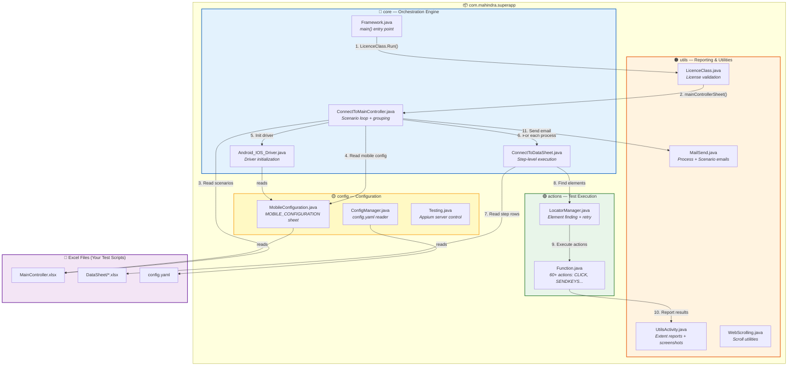
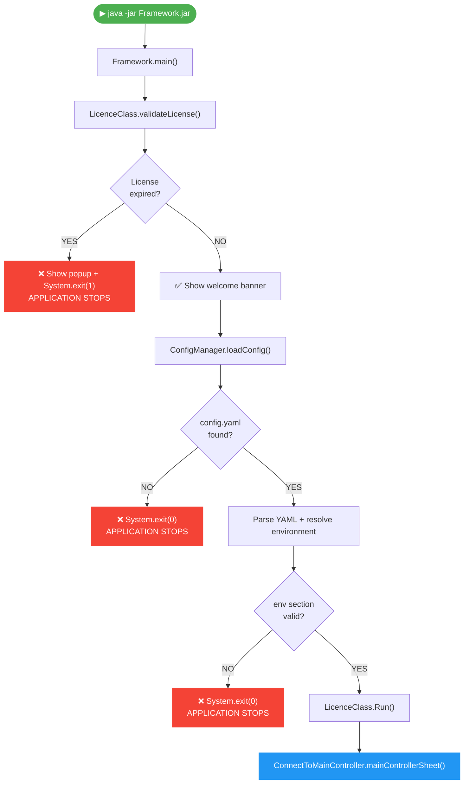
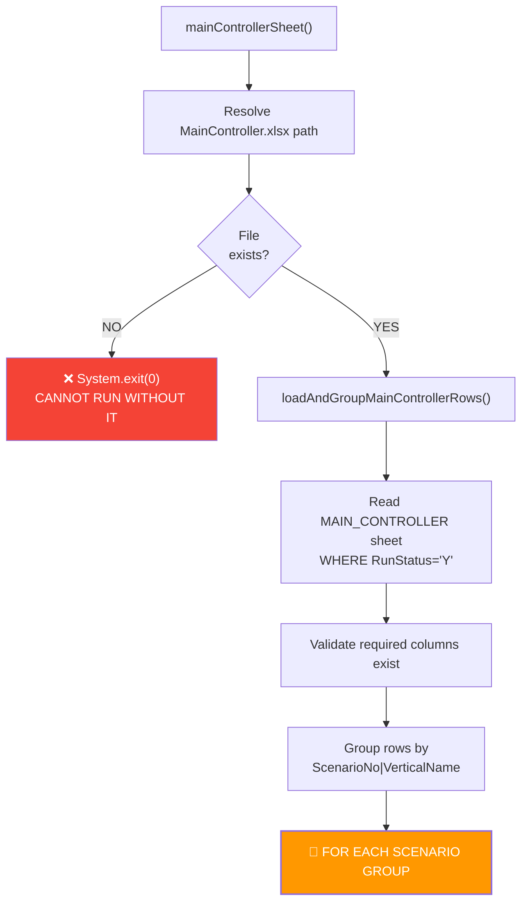
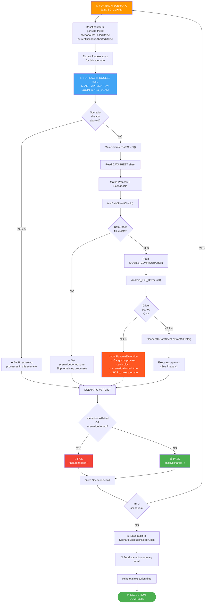
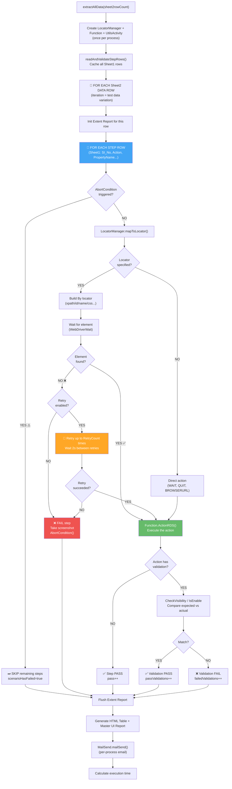
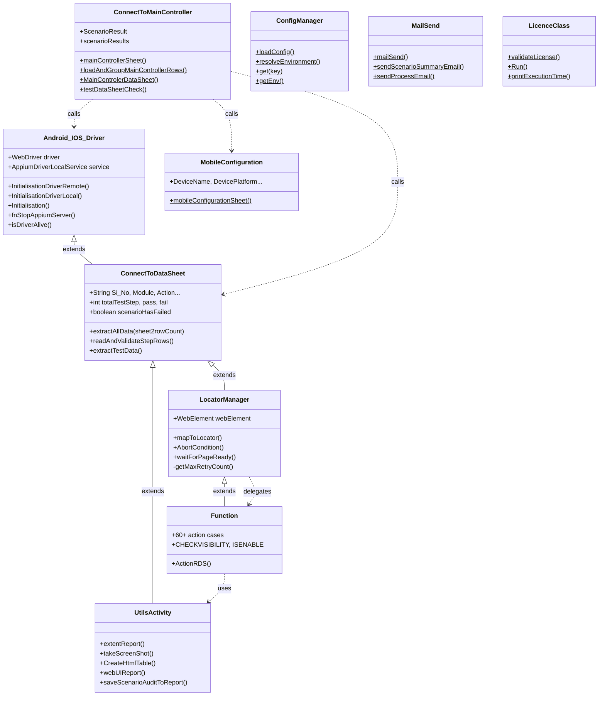
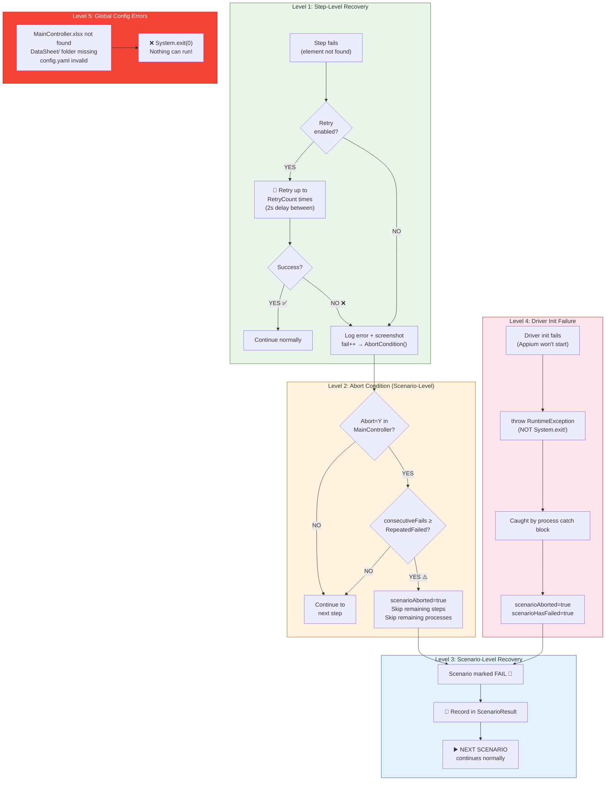
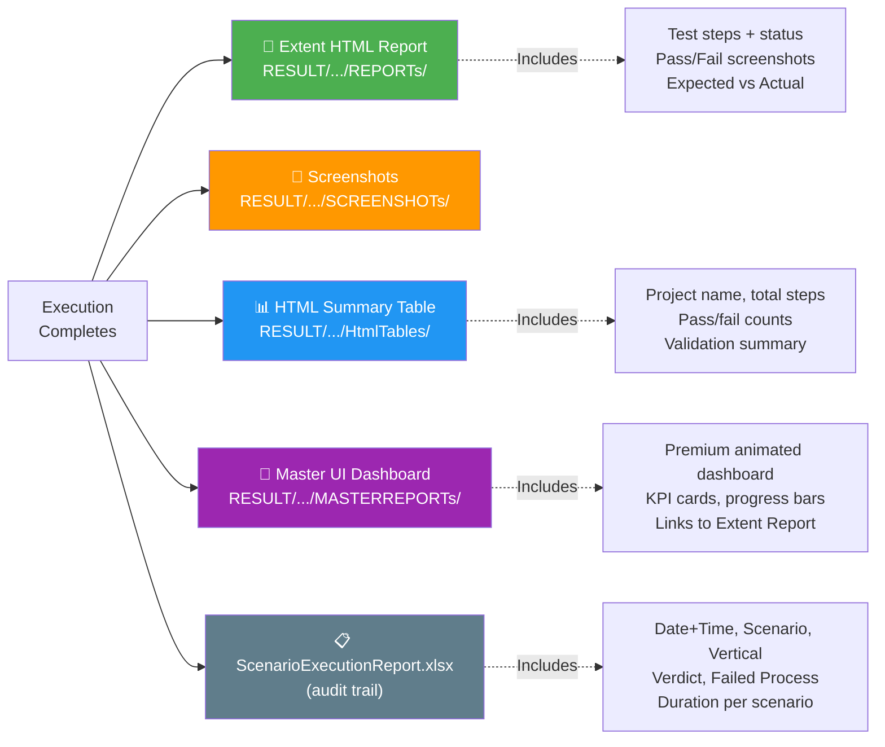
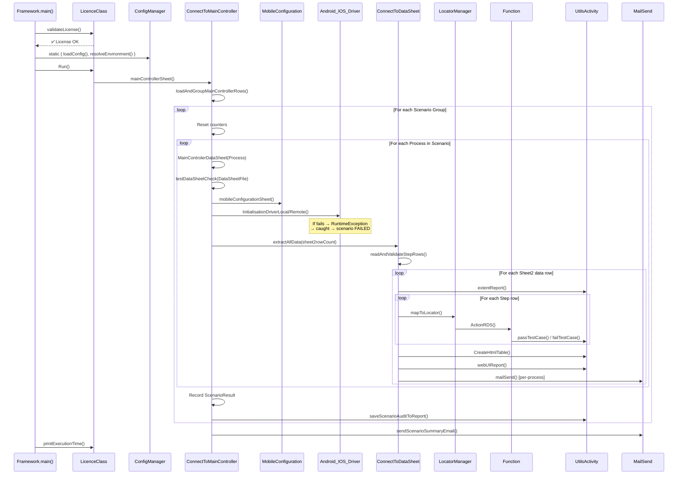

# 🤖 BISWAJIT HYBRID FRAMEWORK

### *Biswajit AI-Powered · Self-Healing · Scriptless Automation*

[](#-license--security)
[](#-execution-modes)
[](#-prerequisites)
[](#-browserstack-remote-execution)
[](#-what-is-this-framework)

> **Zero code. Zero panic. Just Excel → Run → Report.**
> Any fresher who can find a locator can automate Web & Mobile apps.

> **📌 Diagram Rendering:** This README uses [Mermaid](https://mermaid.js.org/) diagrams. They render automatically on **GitHub**, **GitLab**, **Azure DevOps**, and in VS Code with the [Mermaid Preview](https://marketplace.visualstudio.com/items?itemName=bierner.markdown-mermaid) extension. If diagrams show as code blocks, install a Mermaid-compatible markdown viewer.

---

## 📑 Table of Contents

| # | Section | Description |
|---|---------|-------------|
| 1 | [What Is This Framework?](#-what-is-this-framework) | High-level overview for everyone |
| 2 | [Why Use It?](#-why-use-it) | Before vs After comparison |
| 3 | [Key Features](#-key-features) | Feature summary table |
| 4 | [Architecture Overview](#-architecture-overview) | Visual package & class diagram |
| 5 | [Complete Execution Flow](#-complete-execution-flow) | 4-phase lifecycle flowcharts |
| 6 | [Class Inheritance Diagram](#-class-level-inheritance-diagram) | Who extends whom and why |
| 7 | [Excel Sheet Guide](#-excel-sheets--your-test-scripts) | How to write tests using only Excel |
| 8 | [Folder Structure](#-folder-structure) | Where every file lives |
| 9 | [How to Set Up](#-how-to-set-up) | Prerequisites and build |
| 10 | [How to Run](#-how-to-run) | All CLI commands with examples |
| 11 | [Configuration (config.yaml)](#-configuration-configyaml) | Environment-specific settings |
| 12 | [Execution Modes](#-execution-modes) | Local vs Remote (BrowserStack) |
| 13 | [Supported Actions](#-supported-actions) | 60+ actions for your Excel |
| 14 | [Error Handling & Recovery](#-error-handling--recovery) | Multi-level failure strategy |
| 15 | [Reporting System](#-reporting-system) | 5 auto-generated report types |
| 16 | [Email Notifications](#-email-notifications) | Automated email after execution |
| 17 | [License & Security](#-license--security) | License validation details |
| 18 | [FAQ for Freshers](#-faq-for-freshers) | Common questions answered |
| 19 | [Team & Credits](#-team--credits) | Who built this |
| 20 | [Technology Stack](#-technology-stack) | Libraries and versions |

---

## 🧠 What Is This Framework?

The **BISWAJIT Hybrid Framework** is a **no-code, Excel-driven** test automation platform that combines two powerful testing strategies:

| Strategy | What It Means |
|---|---|
| **Keyword-Driven** | You write action keywords like `CLICK`, `SENDKEYS` in Excel. The framework executes them. |
| **Data-Driven** | You supply multiple rows of test data. The framework runs the same steps for every data row automatically. |

### The Golden Rule
> 🔑 **You only need to fill Excel sheets. You never touch Java code.**

The entire engine is packaged as a **single JAR file**. Give it:
- `MainController.xlsx` — which app, which platform, which process to run
- `DataSheet/{Vertical}/{Scenario}/YourApp.xlsx` — what steps to execute and with what data

...and it does everything else: launches browser/app, finds elements, clicks/types/validates, generates HTML & Extent reports, and emails results.

---

## ✅ Why Use It?

| Without This Framework | With This Framework |
|---|---|
| Write 500 lines of Java per test | Fill 5 columns in Excel |
| Need senior dev to add a test | Any fresher can add steps |
| Separate web & mobile codebases | One JAR handles both |
| Manual result compilation | Auto HTML + Extent + Email reports |
| Breaks on every UI change | **Self-Healing** locator strategy |
| Run one dataset at a time | Loop over N data rows automatically |

---

## 🌟 Key Features

| Feature | Description |
|---------|-------------|
| 🧾 **100% Excel-Driven** | All test steps, test data, and configuration live in `.xlsx` files |
| 📱 **Mobile Testing** | Android & iOS apps via Appium (Local device or BrowserStack/LambdaTest cloud) |
| 🌐 **Web Testing** | Chrome, Firefox, Edge via Selenium WebDriver |
| 🔄 **Self-Healing Retry** | Configurable retry mechanism — if a button isn't found, it retries automatically |
| ❌ **Abort Condition** | If too many consecutive steps fail, skip that scenario and continue with the next |
| 📊 **Rich Reporting** | Extent HTML reports + Screenshot reports + Master UI dashboard |
| 📧 **Auto Email** | Sends pass/fail summary email with beautiful HTML tables after execution |
| 📝 **Audit Trail** | Every scenario execution logged to `ScenarioExecutionReport.xlsx` with date+time |
| 🔐 **License Protection** | Built-in license validation and machine-bound authorization |
| ⚙️ **Multi-Environment** | `config.yaml` supports `qa`, `dev`, `staging` environments with fallback |

---

## 🏗 Architecture Overview



---

## 🔄 Complete Execution Flow

This is the **full lifecycle** — from the moment you run the JAR file to the final email being sent.

### Phase 1: Startup & Validation



### Phase 2: MainController — Load & Group Scenarios



### Phase 3: Scenario Loop — The Heart of the Framework



### Phase 4: Step-Level Execution (Inside Each Process)



---

## 🧬 Class-Level Inheritance Diagram

The framework uses class inheritance to share state (driver, locators, counters) across all layers:



**Inheritance chain explained:**
```
Android_IOS_Driver  ← holds the driver object
       ↑
ConnectToDataSheet  ← step-level execution loop
       ↑
  LocatorManager    ← element finding + retry + abort
       ↑
    Function        ← 60+ action implementations
```

Because of this chain, **every class in the framework has access to `driver`** — the core Selenium/Appium driver instance.

---

## 📗 Excel Sheets — Your Test Scripts

> **This is the most important section for testers.** You control everything through Excel. No code changes needed.

### 1. `MainController.xlsx` — The Master Control

This file contains **4 sheets**:

#### Sheet: `MAIN_CONTROLLER` — Define What Scenarios to Run

| Column | Required | Description | Example |
|--------|----------|-------------|---------|
| `Si_No` | ✅ | Serial number | 1, 2, 3 |
| `RunStatus` | ✅ | Y = run, N = skip | Y |
| `ScenarioNo` | ✅ | Scenario group ID | SC_01 |
| `VerticalName` | ✅ | Business vertical | XPL, SALPL, POCL |
| `Scenario` | | Description of what this scenario performs | "Till UW", "Full Journey" |
| `Process` | ✅ | Process/module name | LOGIN, APPLY_LOAN |
| `PlatForm` | ✅ | Mobile or Web | Mobile |
| `ExecutionType` | ✅ | Local or Remote | Local |
| `ApplicationName` | ✅ | App name for reports | SuperApp |
| `Abort` | ✅ | Enable abort condition? | Y |
| `StepsScreenshot` | ✅ | Capture every step screenshot? | Y |
| `SkipLine` | ✅ | BrowserStack multi-data skip | N |
| `Retry` | | Enable retry on element failure? | Y |
| `RetryCount` | | Number of retries | 3 |

#### Sheet: `DATASHEET` — Map Processes to DataSheet Files

| Column | Required | Description | Example |
|--------|----------|-------------|---------|
| `Si_No` | ✅ | Serial number | 1 |
| `RunStatus` | ✅ | Y = active | Y |
| `Process` | ✅ | Must match MAIN_CONTROLLER Process | LOGIN |
| `TestDataSheet` | ✅ | File name inside DataSheet/ folder | DSR.xlsx |
| `ImplicityWait` | ✅ | Implicit wait seconds | 10 |
| `ExplicityWait` | ✅ | Explicit wait seconds | 30 |
| `RepeatedFailed` | ✅ | Abort threshold for consecutive failures | 3 |
| `RetryCount` | | Retry count for element finding | 3 |
| `ScenarioNo` | | *(Optional)* Scenario filter | SC_01 |
| `VerticalName` | | *(Optional)* Vertical filter | XPL |

#### Sheet: `MOBILE_CONFIGURATION` — Device/App Settings

| Column | Description | Example |
|--------|-------------|---------|
| `Process` | Must match MAIN_CONTROLLER Process | LOGIN |
| `RunStatus` | Y to use | Y |
| `App_PackageName` | Android package name | com.mahindra.superapp |
| `App_PackageActivityName` | Launch activity | .ui.SplashActivity |
| `DeviceName` | Device name | Samsung Galaxy S21 |
| `DevicePlatform` | Android or iOS | Android |
| `DevicePlatformVersion` | OS version | 14 |
| `AppiumPort` | Appium server port | 4723 |
| `TestingPlatform` | BrowserStack / LambdaTest / Local | Local |
| `UserName` | Cloud username (if remote) | user@example.com |
| `AccessKey` | Cloud access key (if remote) | abc123key |

#### Sheet: `MAIL_SEND` — Email Configuration

| Column | Description | Example |
|--------|-------------|---------|
| `RunStatus` | Y to send | Y |
| `Process` | Process name | LOGIN |
| `HOST` | Gmail address | qa@mahindra.com |
| `Password` | App password | xxxx xxxx xxxx |
| `MAIL_TO` | Recipients | a@m.com,b@m.com |
| `MAIL_CC` | CC recipients | lead@m.com |
| `SUBJECT` | Email subject | Automation Report |
| `BODY_MESSAGE` | Email body | Test execution completed |
| `SendScenarioSummary` | Y = send scenario summary | Y |

---

### 2. DataSheet Files — Your Test Steps

Located at: `DataSheet/{VerticalName}/{ScenarioNo}/{TestDataSheet}.xlsx`

Example path: `DataSheet/XPL/SC_01/DSR.xlsx`

#### Sheet1 — Test Steps (What to Do)

| Column | Description | Example |
|--------|-------------|---------|
| `Si_No` | Step number | 1 |
| `Module` | Module name (must match Process) | LOGIN |
| `RunStatus` | Y = run | Y |
| `PageName` | Page name | LoginPage |
| `ScenarioID` | Scenario | SC_Login |
| `TestCaseID` | Test case | TC_001 |
| `TestCaseStepID` | Step ID | TS_001 |
| `TestCaseDescription` | Description | Enter SAP Code |
| `TestCaseStepDescription` | Step description | Type SAP code into input |
| `PropertyName` | Locator type | xpath, id, name, css, accessibilityid |
| `PropertyValue` | Locator value | //input[@id='sapcode'] |
| `DataField` | Data column name from Sheet2 | SAPCode |
| `Action` | Action to perform | SENDKEYS, CLICK, CHECKVISIBILITY |
| `ActionType` | Additional action config | *(varies)* |

#### Sheet2 — Test Data (What Data to Use)

| Column | Description | Example |
|--------|-------------|---------|
| `Si_No` | Row number | 1 |
| `RunStatus` | Y = use this data row | Y |
| `ApplicationName` | Must match Module/Process | LOGIN |
| Any custom columns | Your test data | SAPCode=100005482, Password=MyPass |

> 💡 **How It Works:** For each data row in Sheet2 (where RunStatus=Y), ALL steps from Sheet1 are executed. This is how you run the same test with different data sets!

---

## 📁 Folder Structure

```
BISWAJIT-HYBRID-FRAMEWORK/
│
├── 📄 pom.xml                          # Maven build config
├── 📄 config.yaml                      # Environment config (qa/dev/staging)
├── 📄 MainController.xlsx              # 🎯 Master control file
├── 📄 ScenarioExecutionReport.xlsx     # 📊 Auto-generated audit trail
│
├── 📂 src/main/java/com/mahindra/superapp/
│   ├── 📂 core/                        # 🔵 Orchestration engine
│   │   ├── Framework.java              #    Entry point (main method)
│   │   ├── ConnectToMainController.java#    Scenario loop + grouping
│   │   ├── ConnectToDataSheet.java     #    Step-level execution
│   │   └── Android_IOS_Driver.java     #    Driver init (Appium/Selenium)
│   │
│   ├── 📂 config/                      # 🟡 Configuration readers
│   │   ├── ConfigManager.java          #    config.yaml reader
│   │   ├── MobileConfiguration.java    #    MOBILE_CONFIGURATION sheet reader
│   │   └── Testing.java                #    Appium server start/stop
│   │
│   ├── 📂 actions/                     # 🟢 Test action execution
│   │   ├── LocatorManager.java         #    Element finding + retry + abort
│   │   └── Function.java              #    60+ actions (CLICK, SENDKEYS...)
│   │
│   └── 📂 utils/                       # 🟠 Reporting & utilities
│       ├── UtilsActivity.java          #    Extent reports + screenshots + audit
│       ├── MailSend.java               #    Email sending (process + scenario)
│       ├── LicenceClass.java           #    License validation
│       └── WebScrolling.java           #    Web page scrolling utilities
│
├── 📂 DataSheet/                       # 📗 Test data files
│   ├── 📂 XPL/SC_01/DSR.xlsx          #    DataSheet for XPL scenario 1
│   ├── 📂 SALPL/SC_01/DSR.xlsx        #    DataSheet for SALPL scenario 1
│   ├── 📂 POCL/SC_01/DSR.xlsx         #    DataSheet for POCL scenario 1
│   └── 📄 ApplicationID.xlsx          #    Generated application IDs
│
├── 📂 RESULT/                          # 📊 Auto-generated results
│   └── 📂 2026/June/17/SuperApp/
│       ├── 📂 REPORTs/                 #    Extent HTML reports
│       ├── 📂 SCREENSHOTs/             #    Failure screenshots
│       ├── 📂 HtmlTables/              #    Summary HTML tables
│       ├── 📂 MASTERREPORTs/           #    Master UI dashboard
│       └── 📂 STEPs_REPORTs/           #    Per-step screenshot reports
│
└── 📂 target/                          # Maven build output
    ├── BISWAJIT_HYBRID_FRAMEWORK-B1.jar
    └── libs/                           # All dependency JARs
```

---

## ⚡ How to Set Up

### Prerequisites

| Tool | Version | Purpose |
|------|---------|---------|
| Java JDK | 17+ | Runtime & compilation |
| Maven | 3.8+ | Build tool |
| Appium Server | 2.x | Mobile testing only (`npm install -g appium`) |
| Android SDK | Latest | Android device connection |
| Node.js | 18+ | Required for Appium |
| Chrome/Firefox | Latest | Web testing |
| Appium Inspector | Latest | For finding mobile locators |

### Build the Project

```bash
# Navigate to project root
cd BISWAJIT-HYBRID-FRAMEWORK

# Clean + compile + package into JAR
mvn clean package -DskipTests
```

This creates:
- `target/BISWAJIT_HYBRID_FRAMEWORK-B1.jar` — The executable JAR
- `target/libs/` — All dependency JARs

---

## 🚀 How to Run

### Method 1: Default (uses `MainController.xlsx` in project root)

```bash
java -jar target/BISWAJIT_HYBRID_FRAMEWORK-B1.jar
```

### Method 2: Custom MainController File

```bash
java -DuserInputMainController="XPL_MainController.xlsx" \
     -jar target/BISWAJIT_HYBRID_FRAMEWORK-B1.jar
```

### Method 3: Custom MainController + Custom DataSheet Folder

```bash
java -DuserInputMainController="XPL_MainController.xlsx" \
     -DuserInputDataSheetFolderPath="DataSheet" \
     -jar target/BISWAJIT_HYBRID_FRAMEWORK-B1.jar
```

### Method 4: Full Configuration (Recommended for CI/CD)

```bash
java -DuserInputMainController="/absolute/path/to/MainController.xlsx" \
     -DuserInputDataSheetFolderPath="/absolute/path/to/DataSheet" \
     -DuserInputConfigFilePath="/absolute/path/to/config.yaml" \
     -Denv="qa" \
     -jar target/BISWAJIT_HYBRID_FRAMEWORK-B1.jar
```

### Method 5: With Application ID

```bash
java -DapplicationId=MF25013100001149 \
     -jar target/BISWAJIT_HYBRID_FRAMEWORK-B1.jar
```

### All Available JVM Properties (`-D` flags)

| Property | Default | Description |
|----------|---------|-------------|
| `-DuserInputMainController` | `MainController.xlsx` | Path to MainController file |
| `-DuserInputDataSheetFolderPath` | `DataSheet/` | Path to DataSheet folder |
| `-DuserInputConfigFilePath` | `config.yaml` | Path to config YAML file |
| `-Denv` | `defaultEnv` from YAML | Environment: `qa`, `dev`, etc. |
| `-DapplicationId` | `MF25013100001149` | Application ID to use |
| `-DuserInput` | *(none)* | DataSheet filename override |
| `-DrunScenario` | *(none)* | **[NEW]** Run only this ScenarioNo (e.g. `SC_01`). Must be used **together** with `-DrunVertical`. |
| `-DrunVertical` | *(none)* | **[NEW]** Run only this VerticalName (e.g. `XPL`). Must be used **together** with `-DrunScenario`. |

> 💡 **CLI Filter Behaviour:**
> - **Both provided** → The `MAIN_CONTROLLER` query becomes `WHERE RunStatus='Y' AND ScenarioNo='...' AND VerticalName='...'`. Only the matching scenario runs.
> - **Only one provided** → Warning printed, filter is ignored, all `RunStatus='Y'` scenarios run (normal mode).
> - **Neither provided** → Exactly the original behaviour — all `RunStatus='Y'` scenarios run.

### Method 6: Run a Specific Scenario + Vertical (New)

```bash
# Run ONLY SC_01 for the XPL vertical (RunStatus must be Y for it)
java -DrunScenario=SC_01 \
     -DrunVertical=XPL \
     -jar target/BISWAJIT_HYBRID_FRAMEWORK-B1.jar

# Combined with other options
java -DrunScenario=SC_02 \
     -DrunVertical=BAU \
     -DuserInputMainController="MainController.xlsx" \
     -Denv="qa" \
     -jar target/BISWAJIT_HYBRID_FRAMEWORK-B1.jar
```

> Even if SC_01 BAU, SC_03 XPL, SC_04 SALPL all have `RunStatus=Y`, **only** the matching scenario executes when the filter is active.

---

## ⚙ Configuration (config.yaml)

```yaml
defaultEnv: qa          # Used if -Denv is not passed

common:                 # Shared across all environments
  sapcode: 100005482
  password: MyPassword
  mPin: "0008"

qa:                     # QA environment
  browser: chrome
  urls:
    base: https://web-sit.aws.mmfss.net/user
    login: /login
  users:
    admin:
      username: admin
      password: 1234

dev:                    # Dev environment
  browser: firefox
  urls:
    base: https://dev.app.com
    login: /login
```

**Access in DataSheet:** Use `ConfigManager.get("urls.base")` — supports dot-notation for nested keys. Checks environment section first, then falls back to `common`.

---

## 🚀 Execution Modes

| Mode | PlatForm | ExecutionType | What Happens |
|------|----------|---------------|--------------|
| **Web Local** | Web | local | Launches Chrome/Firefox/Edge on your machine |
| **Web Remote** | Web | remote | Connects to BrowserStack grid (any OS + browser) |
| **Mobile Local** | Mobile | local | Appium + USB device/Emulator at localhost:4723 |
| **Mobile Remote** | Mobile | remote | BrowserStack real device cloud |

### Local Mobile Setup

1. Install Appium Server: `npm install -g appium`
2. Install Android driver: `appium driver install uiautomator2`
3. Start Appium: `appium --port 4723`
4. Connect your device via USB (Developer Mode ON)

### BrowserStack Remote Setup

In `MOBILE_CONFIGURATION` sheet:
```
UserName       = your_browserstack_username
AccessKey      = your_browserstack_access_key
TestingPlatform = BrowserStack
```

### BrowserStack with Multiple Data Rows

When `SkipLine = Y` in MAIN_CONTROLLER and you have multiple Sheet2 rows:
- Row 1 → full execution from start to finish (driver started fresh)
- Row 2+ → execution skips to the `RowSkipForRemote` marker step (reuses existing session)

This prevents re-launching the app for every data row on BrowserStack (saves time & cost).

---

## 🎬 Supported Actions

These are the actions you can use in the `Action` column of your DataSheet Sheet1:

### App & Browser Lifecycle

| Action | Description |
|--------|-------------|
| `START_APPLICATION` | Start mobile app (reads MOBILE_CONFIGURATION, inits Appium driver) |
| `INSTALLANDSTARTAPPLICATION` | Install APK and start app |
| `STARTBROWSER` | Launch web browser (Chrome/Firefox/Edge) |
| `BROWSERURL` | Navigate to a URL |
| `NEWWINDOWBROWSWRTAB` | Open new browser tab |
| `NAVIGATEBACK` | Go back one page |
| `PAGEREFRESH` | Refresh current page |
| `QUIT` | Close driver/browser |
| `STARTDRIVER` | Start a new driver session without app |
| `OPENAPP_USINGONLYAPPPACKAGE` | Open app by package name |
| `TERMINATEAPP_USINGONLYAPPPACKAGE` | Force-stop an app |

### Element Interactions

| Action | Description |
|--------|-------------|
| `CLICK` | Click an element |
| `JAVASCRIPTCLICK` | Click via JavaScript (for hidden elements) |
| `CHECKANDCLICK` | Click only if element exists |
| `SENDKEYS` | Type text into an element |
| `CLICKCLEARSENDKEYS` | Click, clear field, then type |
| `SENDKEYSANDENTERKEY` | Type text and press Enter |
| `CLEAR` | Clear input field |
| `JS_CLEARSENDKEYS` | Clear and type using JavaScript |
| `SELECTUPLOADFILE` | Upload a file |
| `GETATTRIBUTEVALUE` | Read an attribute from element |

### Validations

| Action | Description |
|--------|-------------|
| `CHECKVISIBILITY` | Verify element is visible (PASS/FAIL with screenshot) |
| `ISENABLE` | Verify element is enabled |
| `MOBILEGETTEXT` | Get text from mobile element |
| `WEBGETTEXT` | Get text from web element |

### Mobile-Specific

| Action | Description |
|--------|-------------|
| `MPIN` | Enter MPIN digits |
| `GOBACK` / `HIDEKEYBOARD` | Press back / hide keyboard |
| `HIDEKEYBOARDUSINGENTERKEY` | Hide keyboard via Enter key |
| `HIDEKEYBOARDIFITOPEN` | Conditionally hide keyboard |
| `KEYBOARDSENDKEYS` | Send keys via Android KeyEvent |
| `CAMERAIMAGEINJECTION` | Inject camera image (BrowserStack) |
| `PUSHFILETOBROWSERSTACKDEVICE` | Push file to cloud device |
| `SCROLLDOWN` / `SCROLLUP` | Scroll on mobile |
| `SCROLLDOWNTILLELEMENTFOUND` | Scroll until element appears |
| `SWIPELEFTTORIGHT` / `SWIPERIGHTOLEFT` | Swipe gestures |

### Data & Utility

| Action | Description |
|--------|-------------|
| `SENDKEYSUSING_CONFIGVALUE` | Type value from config.yaml |
| `GENERATERANDOMNUMBER` | Generate random number |
| `STOREAPPLICATIONID` | Save application ID to Excel |
| `UPDATEAPPLICATIONID` | Update stored application ID |
| `WAIT` | Static wait (seconds in DataField) |
| `WAIT_FOR_NEXTELEMENT` | Wait for next element to appear |
| `MONITORING_PROPERTIES` | Log current monitoring state |
| `GETPAGESOURCE` | Dump page source to log |

### Web-Specific

| Action | Description |
|--------|-------------|
| `SELECTDROPDOWN` | Select dropdown by visible text |
| `WEBSCROLLDOWN` | Scroll web page down |
| `IFRAME` | Switch to iframe |
| `DEFAULTCONTENT` | Switch back from iframe |
| `SWITCHWINDOW` | Switch browser window/tab |
| `ALERTACCEPT` / `ALERTDISMISS` | Handle alerts |
| `MOUSEOVER` | Hover over element |
| `DOUBLECLICK` | Double-click element |
| `RIGHTCLICK` | Right-click element |
| `DRAGANDDROP` | Drag element to target |

### Locator Strategies (PropertyName column)

| PropertyName | Example PropertyValue | Use When |
|---|---|---|
| `xpath` | `//android.widget.Button[@text='Login']` | Most flexible — mobile & web |
| `id` | `com.app:id/loginBtn` | Best for Android resource IDs |
| `accessibilityid` | `LoginButton` | iOS & Android accessibility |
| `css` | `.login-btn` | Web only |
| `name` | `username` | Web forms |
| `classname` | `android.widget.EditText` | Android class-based |
| `uiautomator` | `new UiSelector().text("Login")` | Advanced Android |
| `linktext` | `Click here` | Web anchor links |
| `partiallinktext` | `Click` | Web partial link match |
| `tagname` | `button` | Web HTML tag |

---

## 🛡 Error Handling & Recovery

The framework has a **multi-level error handling** strategy to ensure maximum test coverage even when failures occur:



### Error Classification

| Error Type | System.exit? | Behavior |
|------------|:------------:|----------|
| MainController.xlsx not found | ✅ YES | Nothing can run — fatal |
| Required columns missing in MAIN_CONTROLLER | ✅ YES | Nothing can run — fatal |
| Base DataSheet/ folder missing | ✅ YES | Nothing can run — fatal |
| config.yaml not found/empty | ✅ YES | Nothing can run — fatal |
| License expired | ✅ YES | Not authorized — fatal |
| Driver init failed (Appium/Selenium) | ❌ NO | Skip scenario → continue |
| MOBILE_CONFIGURATION missing/error | ❌ NO | Skip scenario → continue |
| DataSheet file not found | ❌ NO | Skip scenario → continue |
| Element not found (step failure) | ❌ NO | Retry → AbortCondition → continue |
| Email send failed | ❌ NO | Log warning → continue |

---

## 📊 Reporting System

The framework generates **5 types of reports** automatically:



### Report Path Convention

All reports are saved to:
```
RESULT/{Year}/{Month}/{Day}/{ApplicationName}/{ReportType}/
```

Example:
```
RESULT/2026/June/17/SuperApp/REPORTs/SC_01_XPL_LOGIN_Report_14_30_22.html
```

### Audit Trail (ScenarioExecutionReport.xlsx)

Every scenario execution is appended to `ScenarioExecutionReport.xlsx` with full details:

| Si No | Date | ScenarioID | Application | Vertical | Scenario | Status | Failed At | Time |
|-------|------|------------|-------------|----------|----------|--------|-----------|------|
| 1 | 20/06/2026 09:15:10 | SC_01 | SuperApp | XPL | Till UW | PASS | | 02m 14s |
| 2 | 20/06/2026 09:28:45 | SC_02 | SuperApp | SALPL | Full Journey | FAIL | LOGIN | 01m 30s |
| 3 | 20/06/2026 14:30:05 | SC_01 | SuperApp | XPL | Till UW | PASS | | 02m 08s |

> **Key behavior:** Each scenario is written to the audit file **immediately after it completes** (not at the end of all scenarios). Re-runs on the same day are distinguishable by the timestamp. Data is **never overwritten** — every execution appends new rows.

---

## 📧 Email Notifications

### Two Types of Emails

| Email Type | When Sent | Triggered By |
|------------|-----------|--------------|
| **Process Email** | After each process completes | `MailSend.mailSend()` (if MAIL_SEND RunStatus=Y) |
| **Scenario Summary Email** | After ALL scenarios complete | `MailSend.sendScenarioSummaryEmail()` (if SendScenarioSummary=Y) |

### Process Email Content

Color-coded HTML table with:

| Column | Color | Value |
|--------|-------|-------|
| Project | Green | Application name |
| Execution Type | Yellow | LOCAL / REMOTE |
| Device Platform | Blue | ANDROID / IOS / WEB |
| Total Test Cases | Purple | Unique test cases run |
| Total Test Steps | Blue | All steps executed |
| Passed Steps | Green | Steps that passed |
| Failed Steps | Red | Steps that failed |
| Total Validations | Blue | CheckVisibility count |
| Passed Validations | Green | Validation passes |
| Failed Validations | Red | Validation fails |
| Execution Time | Green | HH:MM:SS duration |

### Scenario Summary Email Content

Premium HTML email containing:

- **KPI Cards** — Total scenarios, passed, failed, duration
- **Progress Bar** — Visual pass/fail percentage
- **Scenario Details Table** — Each scenario with status badge, failed process, and execution time
- **Professional Footer** — Auto-generated by framework

> **Setup:** Add `SendScenarioSummary=Y` column to your `MAIL_SEND` sheet in MainController.xlsx. Configure `HOST`, `Password`, `MAIL_TO`, `MAIL_CC`.

---

## 🔐 License & Security

The `LicenceClass.java` acts as a **commercial license guard** for this framework.

**License validation flow:**
```
Framework JAR starts
   └─ Static block fires BEFORE main()
         └─ Checks today's date vs LICENSE_EXPIRY date
               ├─ Expired? → Popup + System.exit(1) — framework won't run
               ├─ < 30 days left? → Warning popup shown (non-blocking)
               └─ Valid → Welcome banner printed → Execution continues
```

**Key license properties (inside `LicenceClass.java`):**

| Property | Description |
|---|---|
| `LICENSE_EXPIRY` | Expiry date in `dd/MM/yyyy` format |
| `ALLOWED_MACHINE_ID` | Machine restriction (currently disabled) |
| `SUPPORT_EMAIL` | Contact for renewals |

> 🔒 **This is a commercial framework.** Unauthorized copying, redistribution, or use on unlicensed machines is prohibited.
> Contact `support@biswajitautomation.com` for license renewal or queries.

---

## ❓ FAQ for Freshers

**Q: I'm a fresher. Do I need to know Java to use this?**
> ❌ No! You only need Excel. Find the locator (XPath/ID) from the app, paste it in the sheet, pick an Action keyword. Done.

**Q: How do I find XPath for a mobile element?**
> Use Appium Inspector → connect to your device → browse the element tree → copy XPath.

**Q: How do I find XPath for a web element?**
> Open Chrome DevTools (F12) → Inspector tab → right-click element → Copy → Copy XPath.

**Q: My test failed. Where do I look?**
> 1. Check the console output — it prints the failed step clearly
> 2. Open the log file in `RESULT/.../LOGs/` — detailed Log4j logs
> 3. Open the Extent Report in `RESULT/.../REPORTs/` — shows exactly which step failed with screenshot
> 4. Check the email report — summary counts

**Q: Can I run the same steps with 3 different logins?**
> Yes! Add 3 rows in TestScript Sheet2 (RunStatus=Y for all 3). Each row = one full run with your steps.

**Q: What if the element keeps failing to find?**
> 1. Run Appium Inspector / Chrome DevTools to verify the locator is correct
> 2. Check `ExplicityWait` — maybe the page is slow; increase wait seconds
> 3. Enable `Retry=Y` and set `RetryCount=3` in MAIN_CONTROLLER
> 4. If N consecutive steps fail (N = `RepeatedFailed`), the framework aborts that scenario automatically

**Q: Where is the report after execution?**
> `RESULT/` folder → Year → Month → Day → AppName → report type.

**Q: How do I send tests to BrowserStack?**
> Set `ExecutionType=remote` in MainController and fill in BrowserStack username + access key in MOBILE_CONFIGURATION sheet. That's it.

**Q: Do I need to rebuild the JAR every time I change Excel?**
> ❌ No! The JAR reads Excel at runtime. Just change the Excel and re-run the JAR.

**Q: What happens if one scenario fails? Does the whole execution stop?**
> ❌ No! The failed scenario is recorded as FAIL, and the framework **continues with the next scenario**. Only global config errors (missing MainController.xlsx, etc.) stop everything.

---

## 🏢 Team & Credits

| Role | Name |
|------|------|
| **Framework Developer** | Biswajit Sahoo |
| **SVP** | Naresh Yadav |
| **Test Leads** | Vikrant, Shankar, Shruti |
| **Team Members** | Shantesh, Namrata, Shubham, Dinesh, Dhurvesh, Mohini |
| **Organization** | Mahindra & Mahindra Financial Services Limited |

---

## 📋 Technology Stack

| Technology | Version | Purpose |
|------------|---------|---------|
| Java | 16+ | Core language |
| Maven | 3.8+ | Build & dependency management |
| Selenium | 4.31.0 | Web browser automation |
| Appium Java Client | 9.3.0 | Mobile app automation |
| Fillo | 1.18 | Excel file read/write (SQL-like queries) |
| Apache POI | 3.15 | Excel workbook manipulation |
| ExtentReports | 3.1.5 | HTML test reports |
| Log4j2 | 2.22.0 | Logging |
| SnakeYAML | 2.2 | YAML config parsing |
| JavaMail | 1.6.2 | SMTP email sending |
| REST-Assured | 5.3.0 | API testing support |
| JavaFaker | 1.0.2 | Random test data generation |
| Jackson | 2.15.3 | JSON processing |
| PostgreSQL | 42.7.5 | Database connectivity |
| iText7 | 8.0.5 | PDF generation |

---

## 🔧 Method Call Sequence (Developer Reference)

For developers who need to modify or debug the framework:



---

<div align="center">

### 📞 Support

For questions, issues, or license renewal:

**biswajit.sahoo@mahindrafinance.com**

---

*© 2026 Mahindra Finance QA Automation Team — Biswajit AI-POWERED Self-Healing Automation Framework*

*Empowering teams to automate without code since Day 1*

</div>
